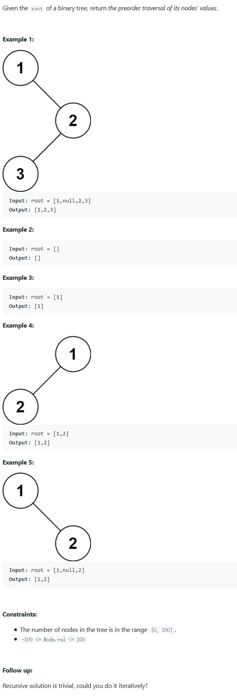

##144. Binary Tree Preorder Traversal - medium - https://leetcode.com/problems/binary-tree-preorder-traversal/

###Refer: https://leetcode-cn.com/problems/binary-tree-postorder-traversal/solution/bang-ni-dui-er-cha-shu-bu-zai-mi-mang-che-di-chi-t/
###Pay Attention - Binary Tree Traversal Order

##Solution 1 - Iteration - TC: O(N), SC: O(H), H is the depths of the tree
```
    public List<Integer> preorderTraversal(TreeNode root) {
        List<Integer> result = new ArrayList<>();
        if (root == null) return result;

        Stack<TreeNode> stack = new Stack<>();
        stack.push(root);
        while(!stack.empty()){
           root = stack.pop();
           result.add(root.val);
           //stack is LIFO, so push right first
           if(root.right !=null) stack.push(root.right);
           if(root.left != null) stack.push(root.left);
        }
        return result;
    }
```
##Solution 2 - DFS: Recursion - TC: O(N), SC: O(N)
```
    public List<Integer> preorderTraversal(TreeNode root) {
        List<Integer> list = new ArrayList<>();
        dfs(root, list);
        return list;
    }

    private void dfs(TreeNode root, List<Integer> result) {
        if (root == null) return;
        result.add(root.val);
        preorderTraversal(root.left, result);
        preorderTraversal(root.right, result);
    }
```