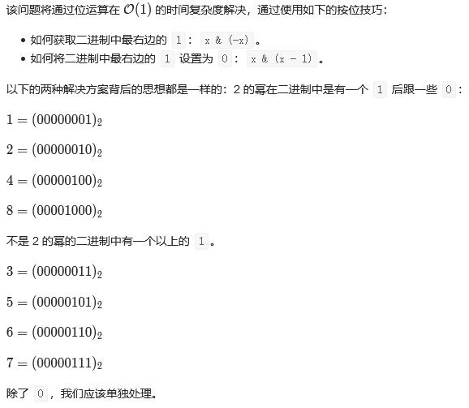
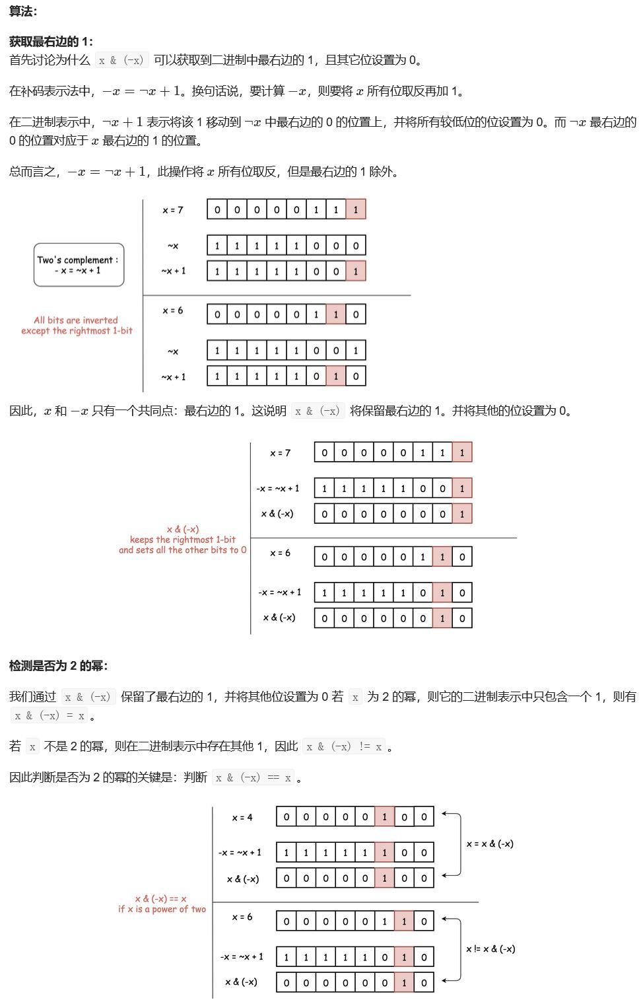

##231. Power of Two - easy - https://leetcode.com/problems/power-of-two/
```
Given an integer, write a function to determine if it is a power of two.

Example 1:

Input: 1
Output: true 
Explanation: 20 = 1

Example 2:

Input: 16
Output: true
Explanation: 24 = 16

Example 3:

Input: 218
Output: false
```

##Solution 1 - Bit Operation - x & (-x) = x; TC: O(1), SC: O(1)

```
    public boolean isPowerOfTwo(int n) {
        if (n == 0) return false;
        long x = (long) n;
        return (x & (-x)) == x;
    }
```
##Solution 2 - Bit Operation - x & (x - 1) 可以将最右边的 1 设置为 0
```
    public boolean isPowerOfTwo(int n) {
        if (n == 0) return false;
        long x = (long) n;
        return (x & (x - 1)) == 0;
    }
```
