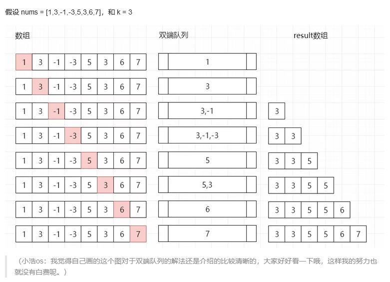

##239. Sliding Window Maximum - hard - https://leetcode.com/problems/sliding-window-maximum/
```
You are given an array of integers nums, there is a sliding window of size k which is moving from the very left of the array to the very right. You can only see the k numbers in the window. Each time the sliding window moves right by one position.

Return the max sliding window.

 

Example 1:

Input: nums = [1,3,-1,-3,5,3,6,7], k = 3
Output: [3,3,5,5,6,7]
Explanation: 
Window position                Max
---------------               -----
[1  3  -1] -3  5  3  6  7       3
 1 [3  -1  -3] 5  3  6  7       3
 1  3 [-1  -3  5] 3  6  7       5
 1  3  -1 [-3  5  3] 6  7       5
 1  3  -1  -3 [5  3  6] 7       6
 1  3  -1  -3  5 [3  6  7]      7

Example 2:

Input: nums = [1], k = 1
Output: [1]

Example 3:

Input: nums = [1,-1], k = 1
Output: [1,-1]

Example 4:

Input: nums = [9,11], k = 2
Output: [11]

Example 5:

Input: nums = [4,-2], k = 2
Output: [4]

 

Constraints:

    1 <= nums.length <= 105
    -104 <= nums[i] <= 104
    1 <= k <= nums.length
```
##Solution 1 - Deque - TC:O(N), SC: O(N-K+1) + O(K) = O(N)

```
    public static int[] maxSlidingWindow(int[] nums, int k) {
        if (nums == null || nums.length < 2) return nums;
        // 双向队列 保存当前窗口最大值的数组位置 保证队列中数组位置的数值按从大到小排序
        LinkedList<Integer> queue = new LinkedList<>();
        // 结果数组
        int[] result = new int[nums.length - k + 1];
        // 遍历nums数组
        for (int i = 0; i < nums.length; i++) {
            // 保证从大到小 如果前面数小则需要依次弹出，直至满足要求 - monotonic decreasing queue
            while (!queue.isEmpty() && nums[queue.peekLast()] <= nums[i]) {
                queue.pollLast();
            }
            // 添加当前值对应的数组下标
            queue.addLast(i);
            // 判断当前队列中队首是否在滑动窗口内
            if (queue.peek() <= i - k) {
                queue.poll();
            }
            // 当形成窗口时，开始存储result
            if (i + 1 >= k) {
                result[i + 1 - k] = nums[queue.peek()];
            }
        }
        return result;
    }
``` 
###Solution 2 - DP - TC: O(N), SC: O(N)
###https://leetcode-cn.com/problems/sliding-window-maximum/solution/hua-dong-chuang-kou-zui-da-zhi-by-leetcode-3/
```
public int[] maxSlidingWindow(int[] nums, int k) {
    int n = nums.length;
    if (n * k == 0) return new int[0];
    if (k == 1) return nums;

    int [] left = new int[n];
    left[0] = nums[0];
    int [] right = new int[n];
    right[n - 1] = nums[n - 1];
    for (int i = 1; i < n; i++) {
      // from left to right
      if (i % k == 0) left[i] = nums[i];  // block_start
      else left[i] = Math.max(left[i - 1], nums[i]);

      // from right to left
      int j = n - i - 1;
      if ((j + 1) % k == 0) right[j] = nums[j];  // block_end
      else right[j] = Math.max(right[j + 1], nums[j]);
    }

    int [] output = new int[n - k + 1];
    for (int i = 0; i < n - k + 1; i++)
      output[i] = Math.max(left[i + k - 1], right[i]);

    return output;
  }
```