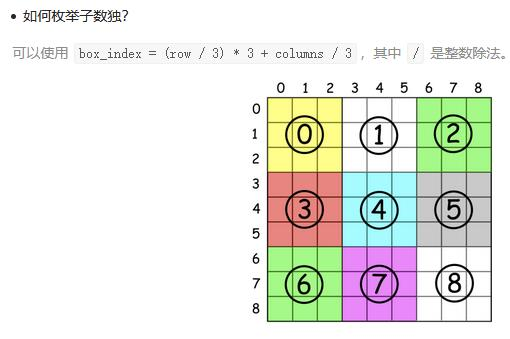

##37. Sudoku Solver - hard - https://leetcode.com/problems/sudoku-solver/

##Solution - DFS & Backtrack - TC: 
##Refer: https://leetcode.com/problems/sudoku-solver/discuss/15752/Straight-Forward-Java-Solution-Using-Backtracking

```
    public void solveSudoku(char[][] board) {
        if (board == null || board.length == 0) return;
        dfs_backtrack(board, 0, 0);
    }

    private boolean dfs_backtrack(char[][] board, int x, int y) {
        if (x == 9) return true; // out of board boundary return true
        if (board[x][y] != '.') return dfs_backtrack(board, y == 8 ? x + 1 : x, y == 8 ? 0 : y + 1);
        for (char c = '1'; c <= '9'; c++) {
            if (isValid(board, x, y, c)) {
                board[x][y] = c;
                if (dfs_backtrack(board, y == 8 ? x + 1 : x, y == 8 ? 0 : y + 1)) return true;
                //backtrack
                board[x][y] = '.';
            }
        }
        return false;
    }

    private boolean isValid(char[][] board, int row, int col, char c) {
        for (int i = 0; i < 9; i++) {
            if (board[row][i] == c) return false; // check row
            if (board[i][col] == c) return false; // check col
            //check 3* 3 block, blockRowIndex = 3 * (row / 3) + i / 3, blockColIndex = 3 * (col / 3) + i % 3
            if (board[3 * (row / 3) + i / 3][3 * (col / 3) + i % 3] == c) return false;
        }
        return true;
    }
```