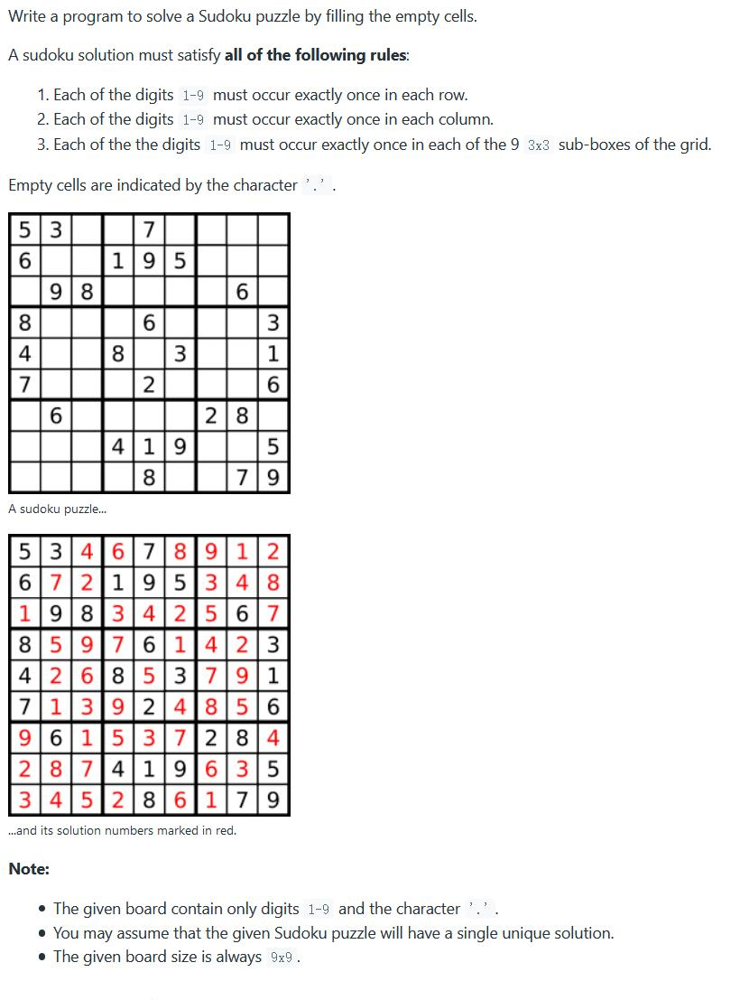

##37. Sudoku Solver - hard - https://leetcode.com/problems/sudoku-solver/

##Solution - DFS & Backtrack - TC: 
```
Code:
    public void solveSudoku(char[][] board) {
        if (board == null || board.length == 0) return;
        dfs_backtrack(board);
    }

    private boolean dfs_backtrack(char[][] board) {
        for (int i = 0; i < board.length; i++) {
            for (int j = 0; j < board[0].length; j++) {
                if (board[i][j] == '.') {
                    //try char '1' ~ '9'
                    for (char ch = '1'; ch <= '9'; ch++) {
                        if (isValid(board, i, j, ch)) {
                            board[i][j] = ch;
                            if (dfs_backtrack(board)) return true;
                            else board[i][j] = '.'; // backtrack, reset
                        }
                    }
                    return false; // if nothing can be set on this '.', return false
                }
            }
        }
        return true;
    }

    private boolean isValid(char[][] board, int row, int col, char ch) {
        for (int i = 0; i < 9; i++) {
            if (board[row][i] == ch) return false; // check row
            if (board[i][col] == ch) return false; // check column
            //check block, blockRowIndex = 3 * (row / 3) + i / 3, blockColIndex = 3 * (col / 3) + i % 3
            if (board[3 * (row / 3) + i / 3][3 * (col / 3) + i % 3] == ch) return false;
        }
        return true;
    }
```