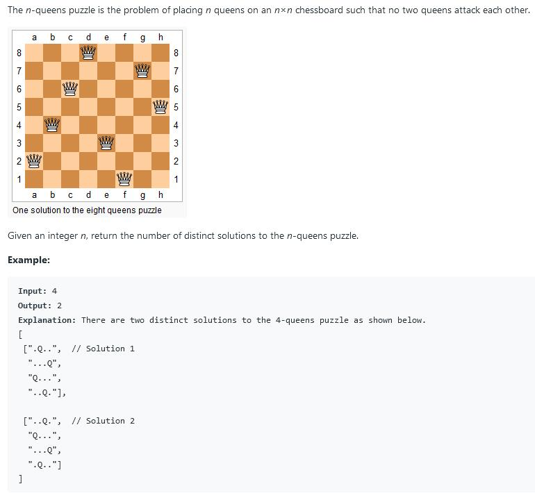

##52. N-Queens II - hard - https://leetcode.com/problems/n-queens-ii/

##Solution - Bit Operation(the Best)
###Time Complexity: O(N!)
```
Code:
    private int size;
    private int count;

    public int totalNQueens(int n) {
        count = 0;
        size = (1 << n) - 1;
        solve(0, 0, 0);
        return count;
    }

    private void solve(int row, int ld, int rd) {
        if (row == size) {
            count++;
            return;
        }
        int pos = size & (~(row | ld | rd));
        while (pos != 0) {
            int p = pos & (-pos);
            pos -= p; // pos &= pos -1
            solve(row | p, (ld | p) << 1, (rd | p) >> 1);
        }
    }
```