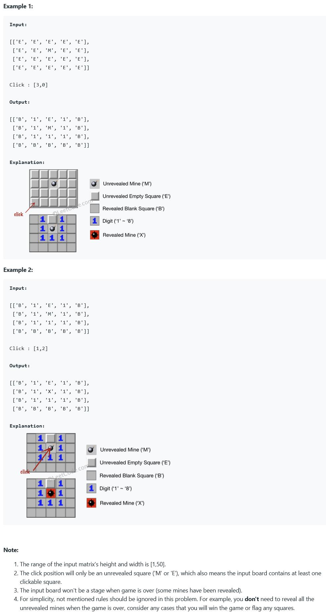

##529. Minesweeper - medium - https://leetcode.com/problems/minesweeper/
```
Let's play the minesweeper game (Wikipedia, online game)!

You are given a 2D char matrix representing the game board. 'M' represents an unrevealed mine, 'E' represents an unrevealed empty square, 'B' represents a revealed blank square that has no adjacent (above, below, left, right, and all 4 diagonals) mines, digit ('1' to '8') represents how many mines are adjacent to this revealed square, and finally 'X' represents a revealed mine.

Now given the next click position (row and column indices) among all the unrevealed squares ('M' or 'E'), return the board after revealing this position according to the following rules:

    If a mine ('M') is revealed, then the game is over - change it to 'X'.
    If an empty square ('E') with no adjacent mines is revealed, then change it to revealed blank ('B') and all of its adjacent unrevealed squares should be revealed recursively.
    If an empty square ('E') with at least one adjacent mine is revealed, then change it to a digit ('1' to '8') representing the number of adjacent mines.
    Return the board when no more squares will be revealed.
```
