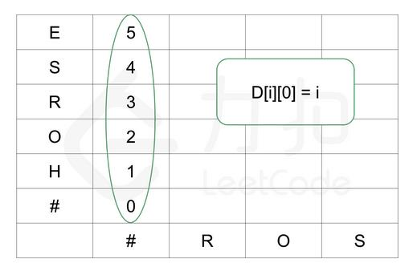
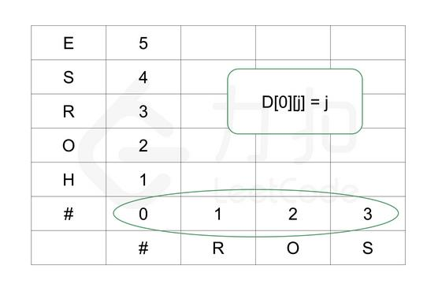
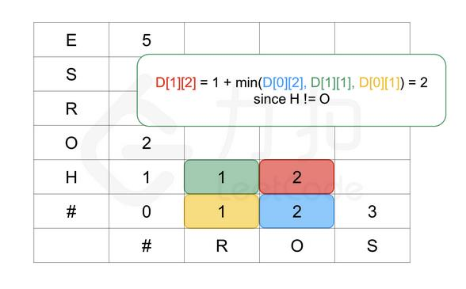
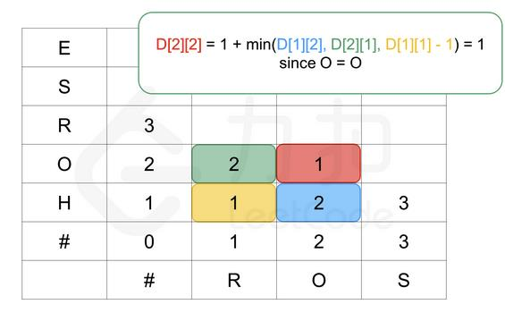
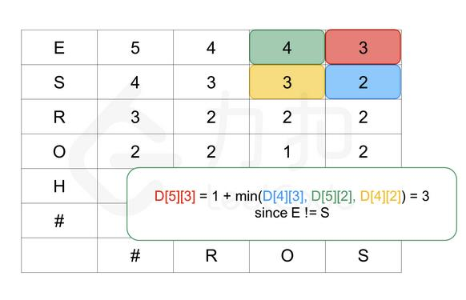

##72. Edit Distance - hard - https://leetcode.com/problems/edit-distance/
```
Given two words word1 and word2, find the minimum number of operations required to convert word1 to word2.

You have the following 3 operations permitted on a word:

    Insert a character
    Delete a character
    Replace a character

Example 1:

Input: word1 = "horse", word2 = "ros"
Output: 3
Explanation: 
horse -> rorse (replace 'h' with 'r')
rorse -> rose (remove 'r')
rose -> ros (remove 'e')

Example 2:

Input: word1 = "intention", word2 = "execution"
Output: 5
Explanation: 
intention -> inention (remove 't')
inention -> enention (replace 'i' with 'e')
enention -> exention (replace 'n' with 'x')
exention -> exection (replace 'n' with 'c')
exection -> execution (insert 'u')
```
###Solution - two-dimensional DP(increase dimension) - TC: O(MN), SC: O(MN) - M, N are the lengths of word1, word2
#####DP function:
#####if(word1[i] == word2[j]) dp[i][j] = 1 + min(dp[i-1][j], dp[i][j-1], dp[i-1][j-1] -1)
#####else dp[i][j] = 1 + min(dp[i-1][j], dp[i][j-1], dp[i-1][j-1])
#####dp[0][0] = 0, dp[1][0] = 1, dp[2][0] = 2, ...
#####              dp[0][1] = 1, dp[0][2] = 2, ...
 
 
 
#####(HO => RO) : HO => R (2 steps: delete H, replace O with R) => RO (3 steps: delete H, replace O with R, add O) 
#####(HO => R0) : H => R (1 step) => O (1 + 0 step)
 
 
```
    public int minDistance(String word1, String word2) {
        char[] arr1 = word1.toCharArray(), arr2 = word2.toCharArray();
        int[][] dp = new int[arr1.length + 1][arr2.length + 1];
        for (int i = 0; i <= arr1.length; i++) {
            for (int j = 0; j <= arr2.length; j++) {
                if (i == 0) dp[0][j] = j;
                if (j == 0) dp[i][0] = i;
                if (i > 0 && j > 0) {
                    if (arr1[i - 1] == arr2[j - 1]) {
                        dp[i][j] = min(dp[i - 1][j] + 1, dp[i][j - 1] + 1, dp[i - 1][j - 1]);
                    } else {
                        dp[i][j] = min(dp[i - 1][j] + 1, dp[i][j - 1] + 1, dp[i - 1][j - 1] + 1);
                    }
                }
            }
        }
        return dp[arr1.length][arr2.length];
    }

    private int min(int a, int b, int c) {
        return Math.min(Math.min(a, b), c);
    }
```