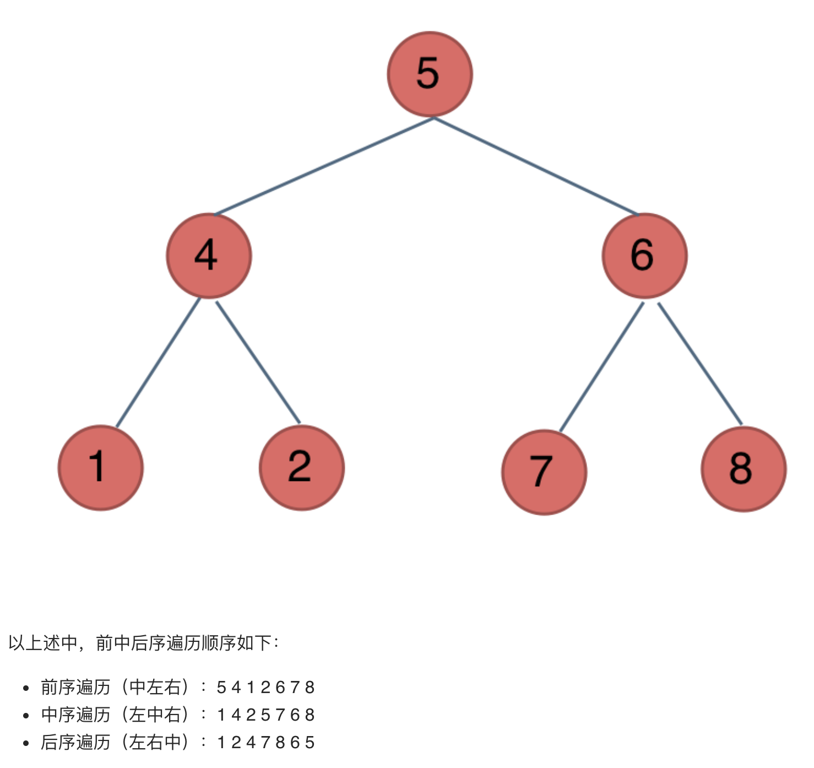

##94. Binary Tree Inorder Traversal - medium - https://leetcode.com/problems/binary-tree-inorder-traversal/

###Refer: https://leetcode-cn.com/problems/binary-tree-postorder-traversal/solution/bang-ni-dui-er-cha-shu-bu-zai-mi-mang-che-di-chi-t/
###Pay Attention - Binary Tree Traversal Order

##Solution 1 - Iteration - TC: O(N), SC: O(H), H is the depths of the tree
```
    public List<Integer> inorderTraversal(TreeNode root) {
        List<Integer> result = new ArrayList<>();
        Stack<TreeNode> stack = new Stack<>();
        while(root != null || !stack.empty()){
            //traverse left
            if(root != null){
                stack.push(root);
                root = root.left;
            }else{
                TreeNode cur = stack.pop();
                result.add(cur.val);
                root = cur.right;
            }
        }
        return result;
    }
```
##Solution 2 - DFS: Recursion - TC: O(N), SC: O(N)
```
    public List<Integer> inorderTraversal(TreeNode root) {
        List<Integer> list = new ArrayList<>();
        if (root == null) return list;
        dfs(root, list);
        return list;
    }

    private void dfs(TreeNode node, List<Integer> list) {
        if (node == null) return;
        if (node.left != null) dfs(node.left, list);
        list.add(node.val);
        if (node.right != null) dfs(node.right, list);
    }
```
