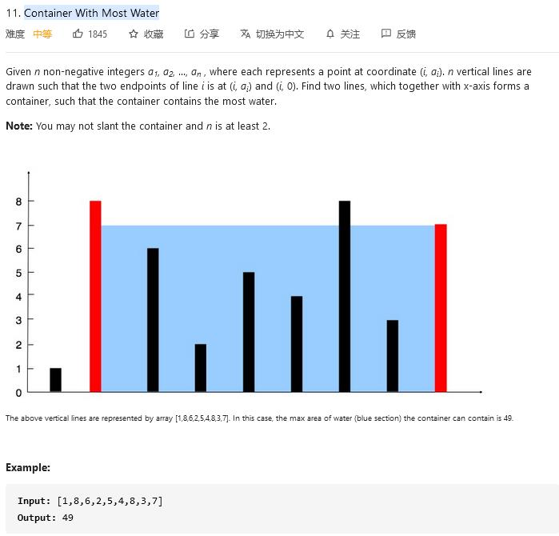

##11. Container With Most Water - medium - https://leetcode.com/problems/container-with-most-water/

###Solution - Two Pointers - TC: O(N), SC: O(1)
```
Code:

    public int maxArea(int[] height) {
        // two pointers
        int left = 0, right = height.length - 1, maxArea = 0;
        while (left < right) {
            maxArea = Math.max(maxArea, Math.min(height[left], height[right]) * (right - left));
            if (height[left] < height[right]) left++;
            else right--;
        }
        return maxArea;
    }
```