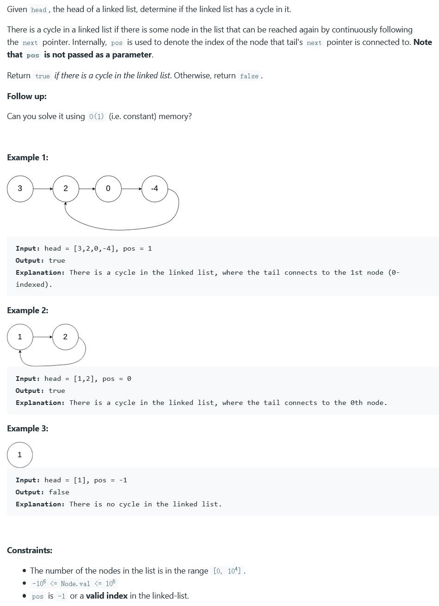

##141. Linked List Cycle - easy - https://leetcode.com/problems/linked-list-cycle/

##Solution 1 - Slow-Fast Pointers - TC: O(N), SC: O(1) 
```
    public boolean hasCycle(ListNode head) {
        if (head == null || head.next == null) return false;
        ListNode slow = head, fast = head.next;
        while (slow != fast) {
            if (fast == null || fast.next == null) return false;
            slow = slow.next;
            fast = fast.next.next;
        }
        return true;
    }
```
##Solution 2 - HashTable - TC: O(n) + O(1) = O(n), SC: O(n)
```
    public boolean hasCycle(ListNode head) {
        Set<ListNode> set = new HashSet<>();
        while (head != null) {
            if (set.contains(head)) return true;
            set.add(head);
            head = head.next;
        }
        return false;
    }
```