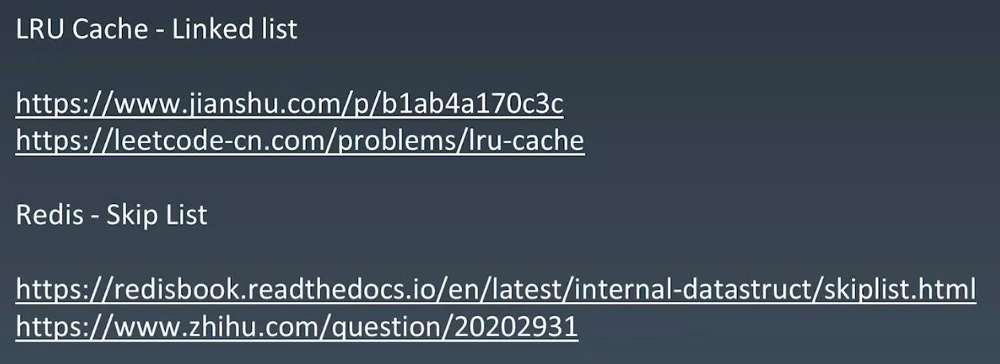

#Arrays LinkedList & SkipList
<br></br>
##Look into java source code: ArrayList, LinkedList
<br></br>
##Array - Search(Time Complexity: O(1)) - PC create memory address for each item in the array, memory controller can easily visit item by memory address

##Array - Insert(TC: O(1) -> O(n) => O(n)) - insert D:  move E, F, G down first, then insert D

##Array - Delete(TC: O(1) -> O(n) => O(n)) - delete Z:  delete Z first, then move E, F, G Up

```
Source Code: ArrayList.java
    /**
     * This helper method split out from add(E) to keep method
     * bytecode size under 35 (the -XX:MaxInlineSize default value),
     * which helps when add(E) is called in a C1-compiled loop.
     */
    private void add(E e, Object[] elementData, int s) {
        if (s == elementData.length)
            elementData = grow();
        elementData[s] = e;
        size = s + 1;
    }

    /**
     * Appends the specified element to the end of this list.
     *
     * @param e element to be appended to this list
     * @return {@code true} (as specified by {@link Collection#add})
     */
    public boolean add(E e) {
        modCount++;
        add(e, elementData, size);
        return true;
    }

    /**
     * Inserts the specified element at the specified position in this
     * list. Shifts the element currently at that position (if any) and
     * any subsequent elements to the right (adds one to their indices).
     *
     * @param index index at which the specified element is to be inserted
     * @param element element to be inserted
     * @throws IndexOutOfBoundsException {@inheritDoc}
     */
    public void add(int index, E element) {
        rangeCheckForAdd(index);
        modCount++;
        final int s;
        Object[] elementData;
        if ((s = size) == (elementData = this.elementData).length)
            elementData = grow();
        System.arraycopy(elementData, index,
                         elementData, index + 1,
                         s - index);
        elementData[index] = element;
        size = s + 1;
    }
```
<br></br>
##LinkedList - element normally defined by Class

```
Source Code: LinkedList.java

public class LinkedList<E>
    extends AbstractSequentialList<E>
    implements List<E>, Deque<E>, Cloneable, java.io.Serializable
{
    transient int size = 0;

    /**
     * Pointer to first node.
     */
    transient Node<E> first;

    /**
     * Pointer to last node.
     */
    transient Node<E> last;

... more

    private static class Node<E> {
        E item;
        Node<E> next;
        Node<E> prev;

        Node(Node<E> prev, E element, Node<E> next) {
            this.item = element;
            this.next = next;
            this.prev = prev;
        }
    }

... more
}
```
##LinkedList - Insert(TC: O(1))

##LinkedList - Delete(TC: O(1))

##LinkedList - Search(TC: O(1) -> O(n) => O(n))
##LinkedList - TC Summary:

<br></br>
##SkipList - (Improving LinkedList: 升维思想 + 空降换时间) - Add layers of indexing

##SkipList - normally add log(2n) indexing

##SkipList - (TC: O(logN))


##SkipList - (SC: O(n))

<br></br>
##Industry
