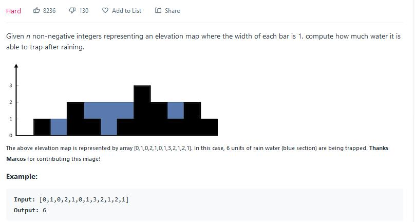

##42. Trapping Rain Water - hard - https://leetcode.com/problems/trapping-rain-water/

##Solution 1 - Monotonous Stack - 这里我们使用单调递减栈 - TC: O(N), SC: O(N) 
##https://leetcode-cn.com/problems/trapping-rain-water/solution/dan-diao-zhan-jie-jue-jie-yu-shui-wen-ti-by-sweeti/
```
Code:
    public int trap(int[] height) {
        if (height == null || height.length <= 1) return 0;
        Stack<Integer> stack = new Stack<>();
        int result = 0;
        for (int i = 0; i < height.length; i++) {
            while(!stack.isEmpty() && height[stack.peek()] < height[i]){
                int cur = stack.pop();
                // if peek element in stack is equal to cur element, then pop it out and only keep one
                while(!stack.isEmpty() && height[stack.peek()] == height[cur]){
                    stack.pop();
                }
                if(!stack.isEmpty()){
                    //leftBoundary is the left side can hold the rain water
                    int leftBoundary = stack.peek();
                    int distance = (i - leftBoundary -1);
                    result += (Math.min(height[leftBoundary], height[i]) - height[cur]) * distance;
                }
            }
            stack.push(i);
        }
        return result;
    }
```
##Solution 2 - DP(Dynamic Programming) or Brute Force & Cache - TC: O(N), SC: O(N)
##https://leetcode-cn.com/problems/trapping-rain-water/solution/tu-jie-jie-yu-shui-dong-tai-gui-hua-he-shuang-zhi-/
##https://leetcode-cn.com/problems/trapping-rain-water/solution/jie-yu-shui-by-leetcode/
```
    public int trap(int[] height) {
        if (height == null || height.length <= 1) return 0;
        //leftMax[i] means item i's left side max item 
        int[] leftMax = new int[height.length], rightMax = new int[height.length];
        //calculate leftMax
        for (int i = 1; i < height.length - 1; i++) {
            leftMax[i] = Math.max(leftMax[i-1], height[i-1]);
        }
        //calculate rightMax
        for(int i=height.length-2;i>=0;i--){
            rightMax[i] = Math.max(rightMax[i+1], height[i+1]);
        }
        int result = 0;
        for(int i = 1;i< height.length-1;i++){
            int minHeight = Math.min(leftMax[i], rightMax[i]);
            if(minHeight > height[i]){
                result += minHeight - height[i];
            }
        }
        return result;
    }
```
##Solution 3 - Two Pointers(Improved DP) - TC: O(N), SC: O(1)
##https://leetcode-cn.com/problems/trapping-rain-water/solution/tu-jie-jie-yu-shui-dong-tai-gui-hua-he-shuang-zhi-/
##https://leetcode-cn.com/problems/trapping-rain-water/solution/jie-yu-shui-by-leetcode/
```
Code:
    public int trap(int[] height) {
        if (height == null || height.length <= 1) return 0;
        int left = 0, right = height.length - 1;
        int result = 0;
        int leftMax = 0, rightMax = 0;
        while (left < right) {
            if(height[left] < height[right]){
                if(height[left] >= leftMax){
                    leftMax = height[left];
                }else{
                    result += leftMax - height[left];
                }
                //move left pointer
                ++left;
            }else{
                if(height[right] >= rightMax){
                    rightMax = height[right];
                }{
                    result += rightMax - height[right];
                }
                //move right pointer
                --right;
            }
        }
        return result;
    }
```
