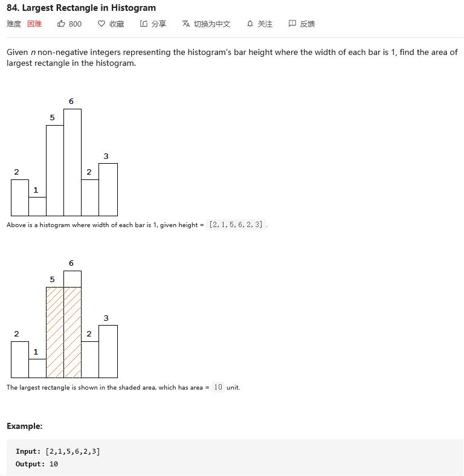

##84. Largest Rectangle in Histogram - hard - https://leetcode.com/problems/largest-rectangle-in-histogram/

##Solution - Monotonous Stack - TC:O(N), SC:O(N)
##refer: https://leetcode-cn.com/problems/largest-rectangle-in-histogram/solution/zhu-zhuang-tu-zhong-zui-da-de-ju-xing-by-leetcode-/
```
Code:
    public static int largestRectangleArea(int[] heights) {
        if (heights == null || heights.length == 0) return 0;
        //add left and right boundary
        int[] newHeights = new int[heights.length +2];
        System.arraycopy(heights, 0, newHeights, 1, heights.length);
        Stack<Integer> stack = new Stack<>();
        int area = 0;
        for(int i = 0;i< newHeights.length;i++){
            while(!stack.empty() && newHeights[i] < newHeights[stack.peek()]){
                //for index: stack.peek(), right boudary is i, left boundary is stack.peek()
                int popIndex = stack.pop();
                area = Math.max(area, newHeights[popIndex] * (i-stack.peek() - 1));// minus extra 1, because we added extra left&right boundary at the begining
            }
            stack.push(i);
        }
        return area;
    }
```