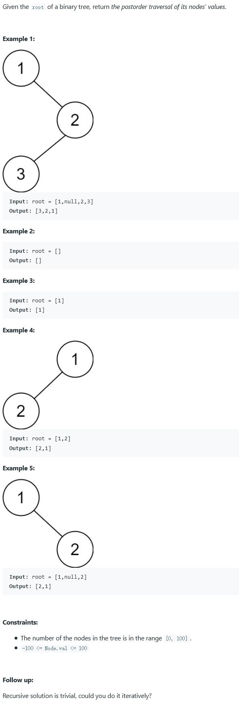

##145. Binary Tree Postorder Traversal - medium - https://leetcode.com/problems/binary-tree-postorder-traversal/

##Solution 1 - Iteration - TC: O(N), SC: O(H), H is the depths of the tree
```
Code:
    public List<Integer> postorderTraversal(TreeNode root) {
        LinkedList<Integer> result = new LinkedList<>();
        if(root == null) return result;
        Stack<TreeNode> stack = new Stack<>();
        stack.push(root);
        while(!stack.empty()){
            TreeNode node = stack.pop();
            result.addFirst(node.val);
            if(node.left!=null) stack.push(node.left);
            if(node.right!=null) stack.push(node.right);
        }
        return result;
    }
```
##Solution 2 - Recursion - TC: O(N), SC: O(N)
```
Code:
    public List<Integer> postorderTraversal(TreeNode root) {
        List<Integer> list = new ArrayList<>();
        postorderTraversal(root, list);
        return list;
    }

    private void postorderTraversal(TreeNode root, List<Integer> result) {
        if (root == null) return;
        postorderTraversal(root.left, result);
        postorderTraversal(root.right, result);
        result.add(root.val);
    }
```