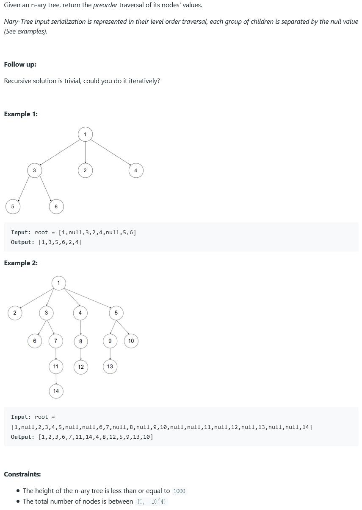

##589. N-ary Tree Preorder Traversal - easy - https://leetcode.com/problems/n-ary-tree-preorder-traversal/

```
    class Node {
        public int val;
        public List<Node> children;

        public Node() {
        }

        public Node(int _val) {
            val = _val;
        }

        public Node(int _val, List<Node> _children) {
            val = _val;
            children = _children;
        }
    }
```
##Solution 1 - Iteration
```
Code:
    public List<Integer> preorder(Node root) {
        List<Integer> list = new LinkedList<>();
        if (root == null) return list;
        Stack<Node> stack = new Stack<>();
        stack.push(root);
        while (!stack.isEmpty()) {
            Node cur = stack.pop();
            list.add(cur.val);
            for (int i = cur.children.size() - 1; i >= 0; i--) {
                stack.push(cur.children.get(i));
            }
        }
        return list;
    }
```
##Solution 2 - Recursion
```
Code:
    public List<Integer> preorder(Node root) {
        List<Integer> list= new ArrayList<>();
        preorder(root, list);
        return list;
    }

    private void preorder(Node root, List<Integer> list) {
        if (root == null) return;
        list.add(root.val);
        for (Node child : root.children) {
            preorder(child, list);
        }
    }
```