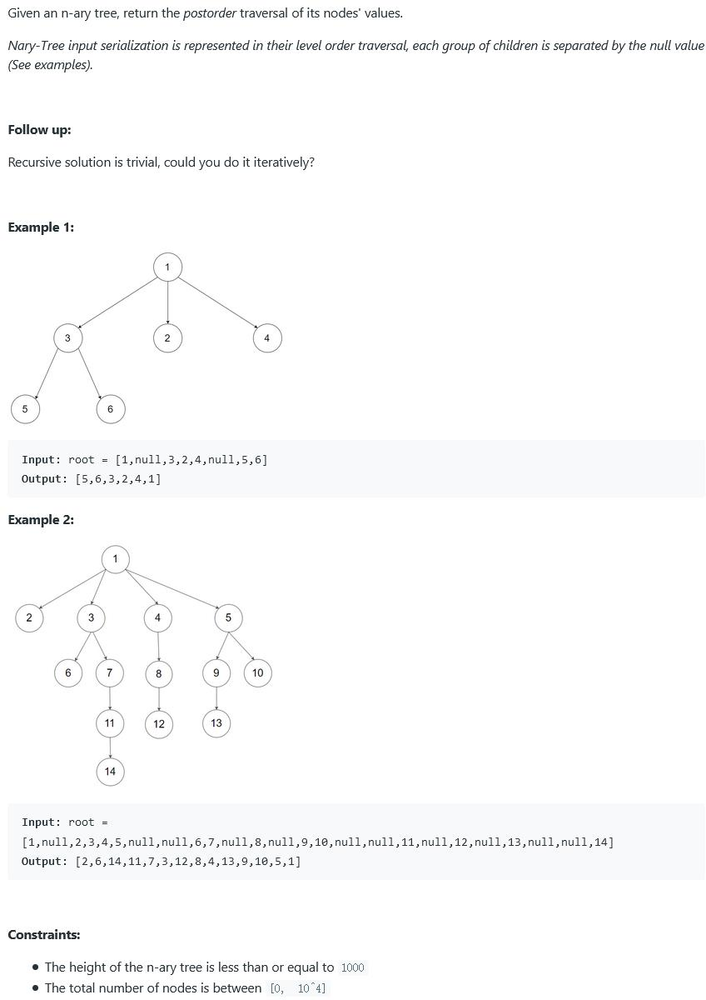

##590. N-ary Tree Postorder Traversal - easy - https://leetcode.com/problems/n-ary-tree-postorder-traversal/

```
    class Node {
        public int val;
        public List<Node> children;

        public Node() {
        }

        public Node(int _val) {
            val = _val;
        }

        public Node(int _val, List<Node> _children) {
            val = _val;
            children = _children;
        }
    }
```
##Solution 1 - Iteration - TC: O(N), SC: O(N)
```
Code:
    public List<Integer> postorder(Node root) {
        LinkedList<Integer> list = new LinkedList<>();
        if (root == null) return list;
        LinkedList<Node> stack = new LinkedList<>();
        stack.add(root);
        while (!stack.isEmpty()) {
            Node cur = stack.pollFirst();
            list.offerFirst(cur.val);
            for(Node child: cur.children){
                stack.addFirst(child);
            }
        }
        return list;
    }
```
##Solution 2 - Recursion
```
Code:
    public List<Integer> postorder(Node root) {
        List<Integer> result = new ArrayList<>();
        postorder(root, result);
        return result;
    }

    private void postorder(Node root, List<Integer> list) {
        if (root == null) return;
        if (root.children != null && !root.children.isEmpty()) {
            for (Node node : root.children) {
                postorder(node, list);
            }
        }
        list.add(root.val);
    }
```