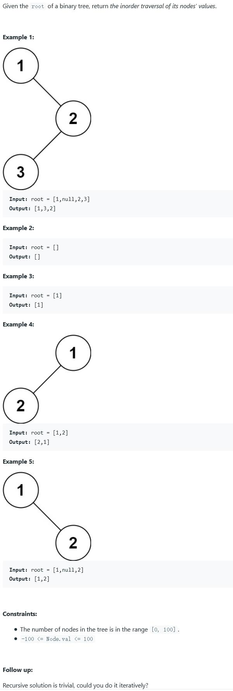

##94. Binary Tree Inorder Traversal - medium - https://leetcode.com/problems/binary-tree-inorder-traversal/

##Solution 1 - Iteration - TC: O(N), SC: O(H), H is the depths of the tree
```
Code:
    public List<Integer> inorderTraversal(TreeNode root) {
        List<Integer> result = new ArrayList<>();
        Stack<TreeNode> stack = new Stack<>();
        while(root != null || !stack.empty()){
            //traverse left
            if(root != null){
                stack.push(root);
                root = root.left;
            }else{
                TreeNode cur = stack.pop();
                result.add(cur.val);
                root = cur.right;
            }
        }
        return result;
    }
```
##Solution 2 - Recursion - TC: O(N), SC: O(N)
```
Code:
    public List<Integer> inorderTraversal(TreeNode root) {
        List<Integer> list = new ArrayList<>();
        inorderTraversal(root, list);
        return list;
    }

    private void inorderTraversal(TreeNode root, List<Integer> result) {
        if (root == null) return;
        inorderTraversal(root.left, result);
        result.add(root.val);
        inorderTraversal(root.right, result);
    }
```
