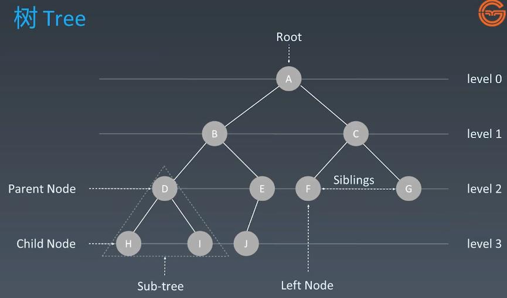
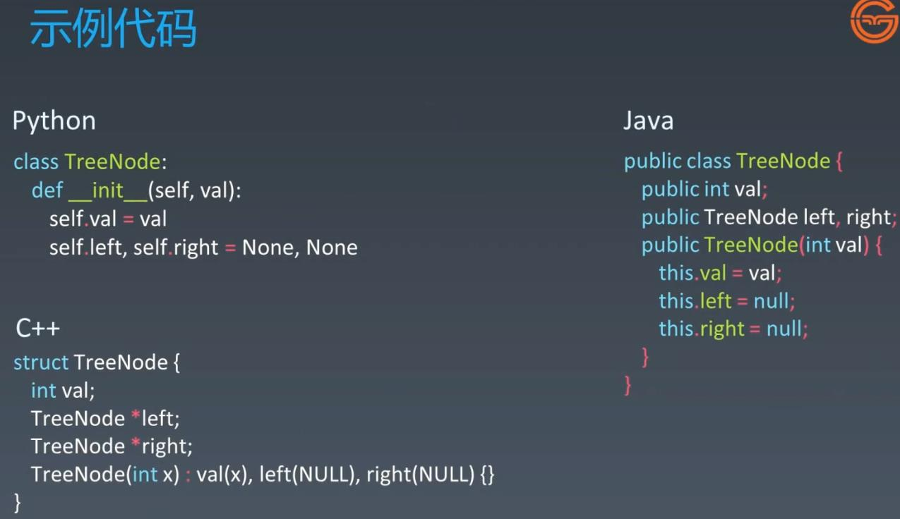
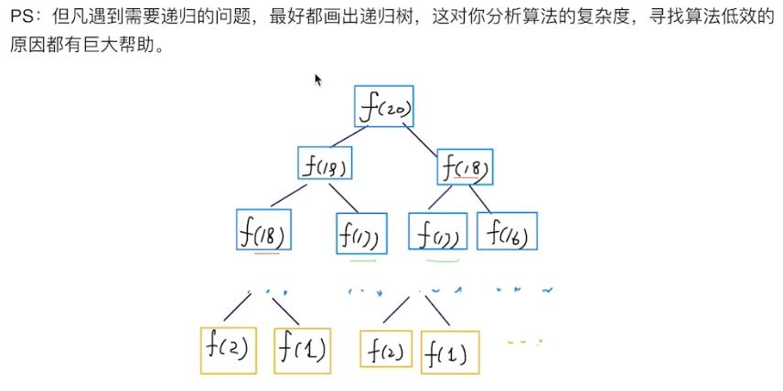
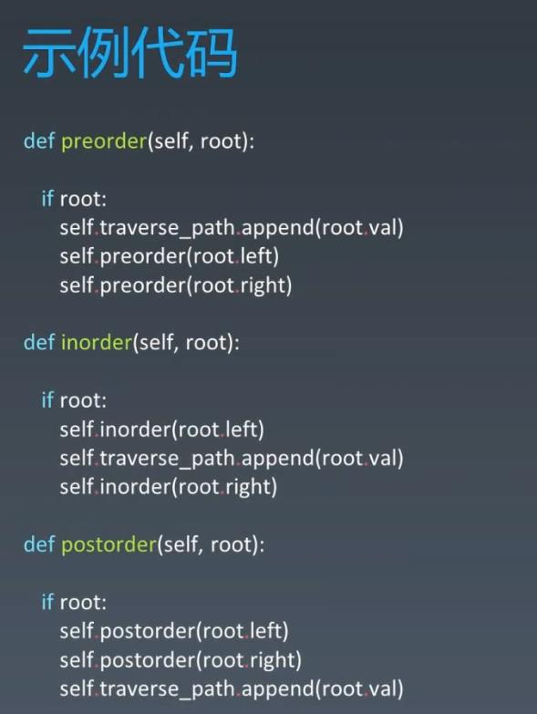
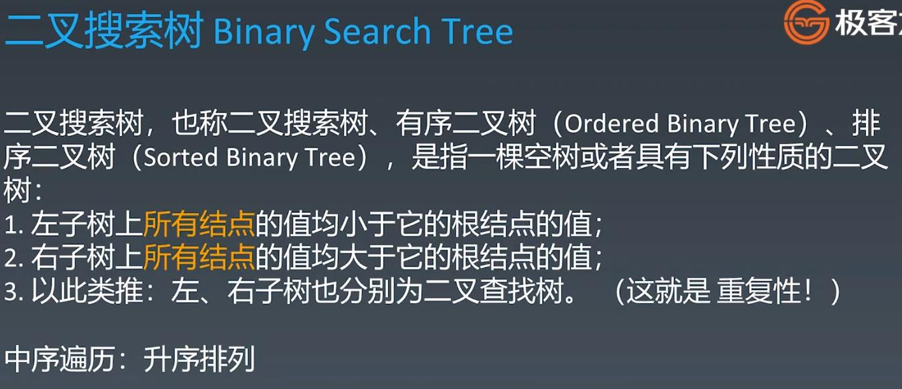
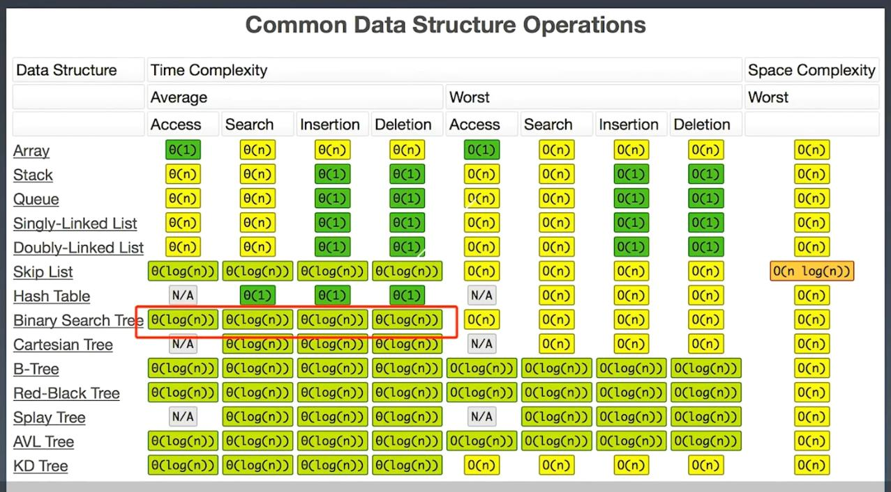

#Tree, Binary Tree, Binary Search Tree
  
##Tree
###Search in linked list is O(N), to improve it we have to increase its dimension, then it becomes a tree, then search becomes O(logN)

###Binary Tree - each node will have less than 2 child nodes

###Graph - there is loop in the tree

###Tree Node Code

###Fibannaci Recursive Tree

###Binary Tree Traversal

  
###Binary Search Tree - Inorder Traversal - sorted values ascending order 
###Search/Insert: O(logN)

###Binary Search Tree TC
