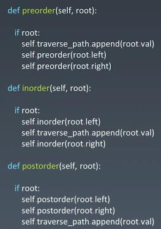
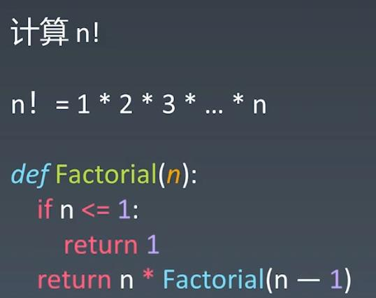
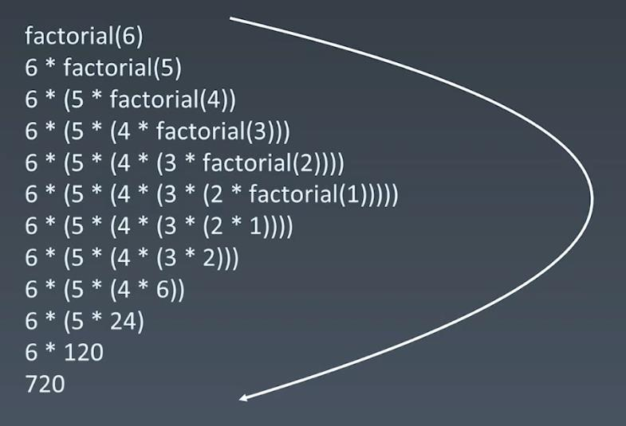
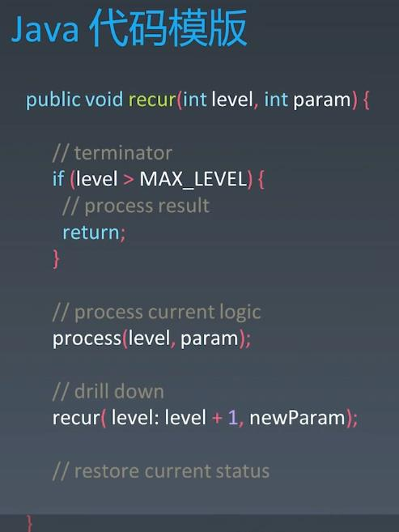
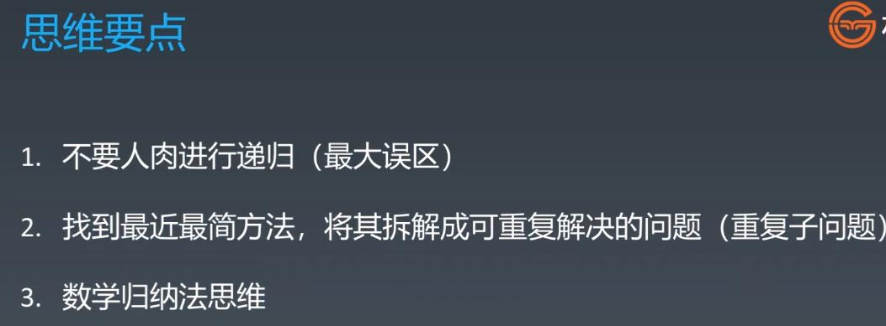

#Recursion - DFS
##Tree Recursion - Preorder(root-left-right), Inorder(left-root-right), Postorder(left-right-root)
 
##Fibonnaci
 
 
## Code Template:
```
function recursion(params){
    // terminator
        ...
    // process current logic
        ...
    // drill down
       recursion(...)
    // revert state
       ...
}
```

##Recursion - Always think about code/logic repeatability instead of Brute Force

