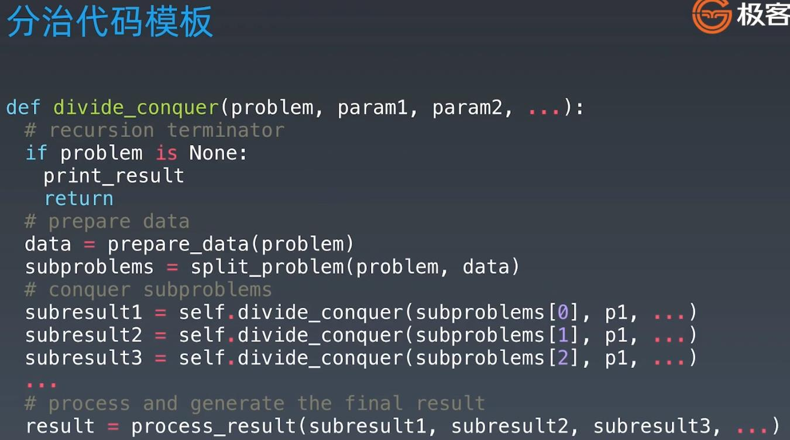
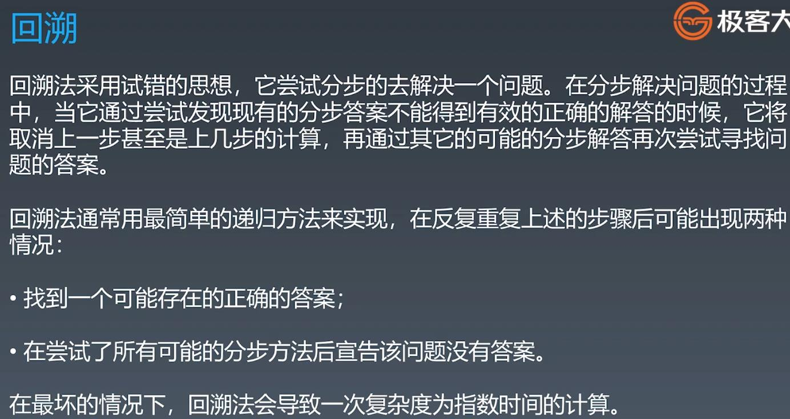

## Divide & Conquer (分治)
### the essence is a special recursion - Think Code/Logic repeatability

 
 
### For example: convert "a b c d e f g h i j" to capital letters

 
 
### Code Template

 
 
 
 
### Backtracking (回溯)
####回溯是一种通过穷举所有可能情况来找到所有解的算法。如果一个候选解最后被发现并不是可行解，回溯算法会舍弃它，并在前面的一些步骤做出一些修改，并重新尝试找到可行解。
