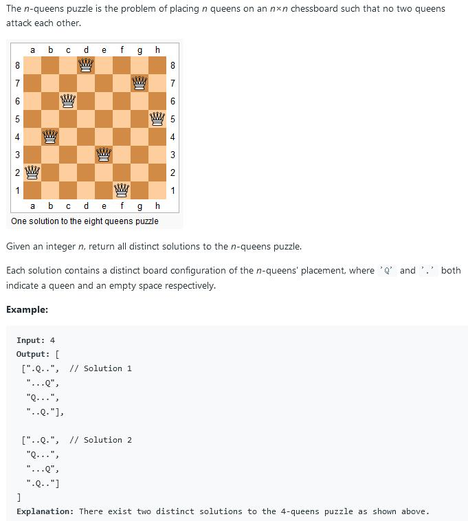

##51. N-Queens - hard - https://leetcode.com/problems/n-queens/

###Solution - Backtrack - TC: O(N!), SC: O(N)
###Refer: https://leetcode-cn.com/problems/n-queens/solution/nhuang-hou-jing-dian-hui-su-suan-fa-tu-wen-xiang-j/
```
    public List<List<String>> solveNQueens(int n) {
        //init board
        char[][] chess = new char[n][n];
        for (int i = 0; i < n; i++)
            for (int j = 0; j < n; j++)
                chess[i][j] = '.';
        List<List<String>> res = new ArrayList<>();
        dfs_backtrack(res, chess, 0);
        return res;
    }

    private void dfs_backtrack(List<List<String>> res, char[][] chess, int row) {
        // terminator
        if (row == chess.length) {
            res.add(construct(chess));
            return;
        }
        for (int col = 0; col < chess.length; col++) {
            if (valid(chess, row, col)) {
                chess[row][col] = 'Q';
                dfs_backtrack(res, chess, row + 1);
                // reset state, backtrack
                chess[row][col] = '.';
            }
        }
    }

    //tell top, left-top, right-top direction
    private boolean valid(char[][] chess, int row, int col) {
        // tell valid on column top
        for (int i = 0; i < row; i++) {
            if (chess[i][col] == 'Q') {
                return false;
            }
        }
        // tell valid on column top-right
        for (int i = row - 1, j = col + 1; i >= 0 && j < chess.length; i--, j++) {
            if (chess[i][j] == 'Q') {
                return false;
            }
        }
        // tell valid on column top-left
        for (int i = row - 1, j = col - 1; i >= 0 && j >= 0; i--, j--) {
            if (chess[i][j] == 'Q') {
                return false;
            }
        }
        return true;
    }

    //convert two-dimension array to list
    private List<String> construct(char[][] chess) {
        List<String> path = new ArrayList<>();
        for (int i = 0; i < chess.length; i++) {
            path.add(new String(chess[i]));
        }
        return path;
    }
```