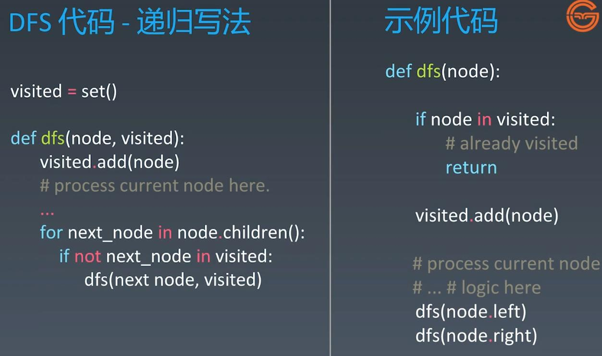
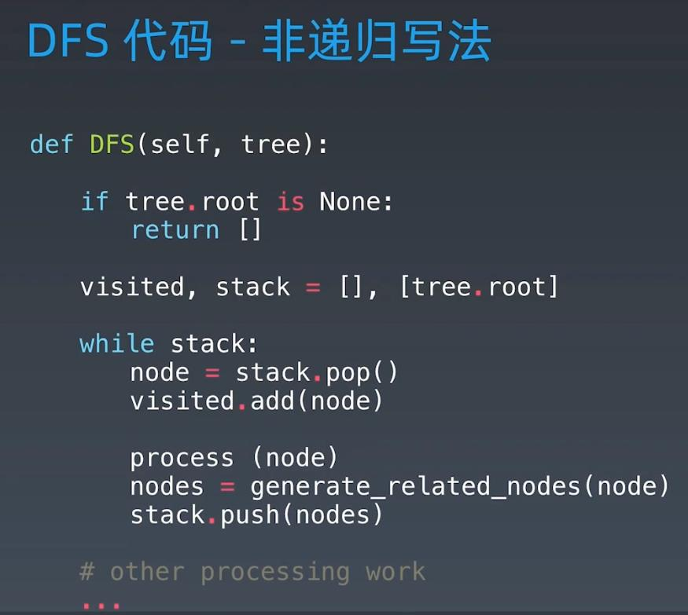
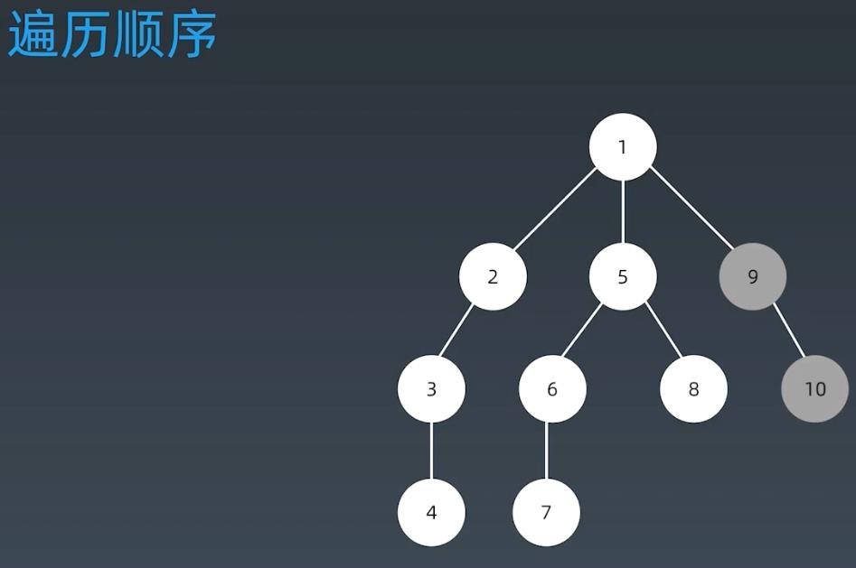
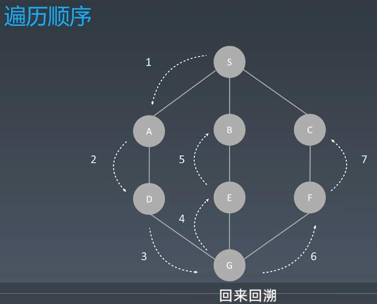
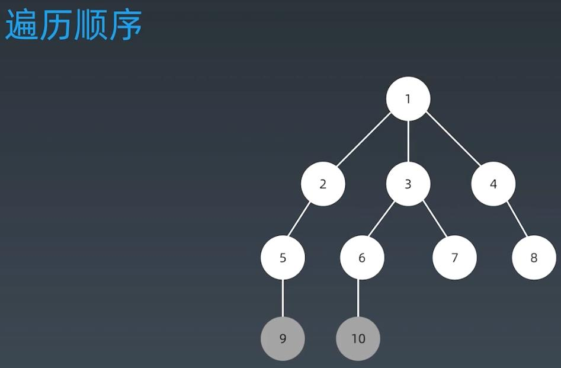
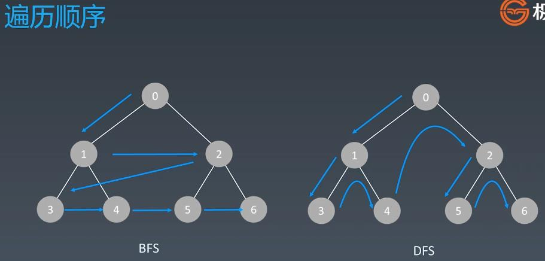
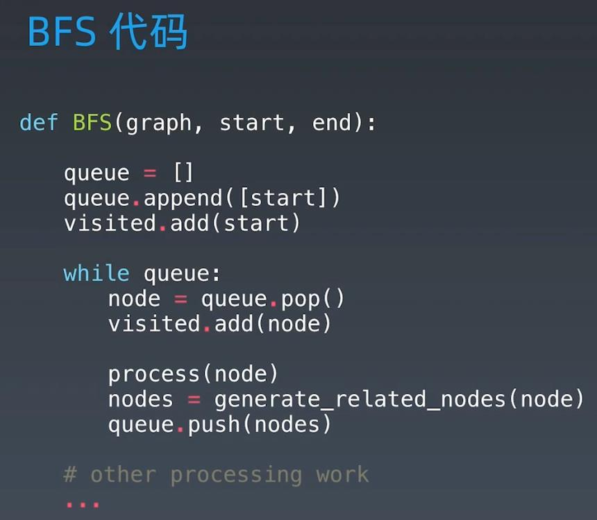

##DFS(Depth First Search) 
###DFS(multiple branch tree vs binary tree):

###DFS use stack instead of recursion => BFS

###DFS Traversal Order

###DFS & Backtrack e.g: step 5 reach node B -> because node S is visited, backtrack to node E -> backtrack to node G -> step 6, go to node F

  
##BFS(Breadth First Search)
###BFS Traversal Order

###BFS vs DFS

###BFS Code

  
###Leetcode:
####102. Binary Tree Level Order Traversal - medium - https://leetcode.com/problems/binary-tree-level-order-traversal/
####433. Minimum Genetic Mutation - medium - https://leetcode.com/problems/minimum-genetic-mutation/
####22. Generate Parentheses - Medium -- https://leetcode.com/problems/generate-parentheses/
####515. Find Largest Value in Each Tree Row - medium - https://leetcode.com/problems/find-largest-value-in-each-tree-row/
####127. Word Ladder - medium - https://leetcode.com/problems/word-ladder/
####126. Word Ladder II - hard - https://leetcode.com/problems/word-ladder-ii/
####200. Number of Islands - medium - https://leetcode.com/problems/number-of-islands/
####529. Minesweeper - medium - https://leetcode.com/problems/minesweeper/