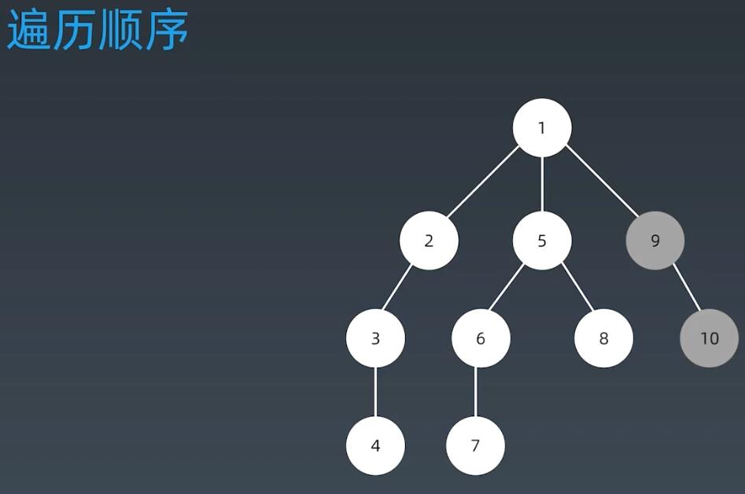

##DFS(Depth First Search) 
###DFS(multiple children tree vs binary tree):

###DFS use stack instead of recursion

###DFS Transversal Order

##BFS(Breadth First Search)
###BFS Traversal Order

###BFS Code
