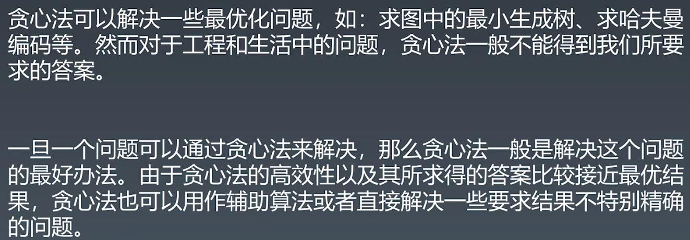
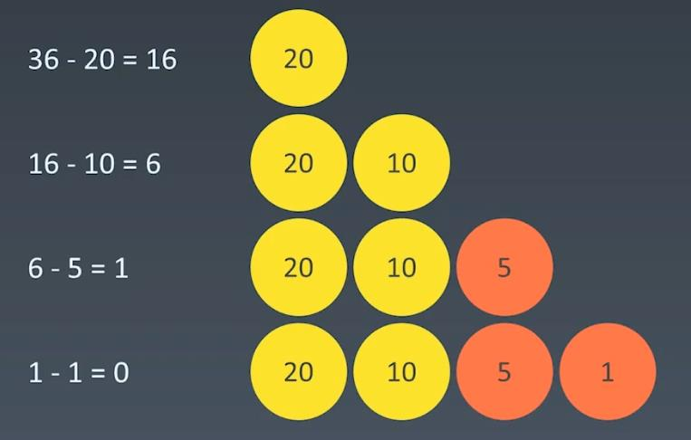
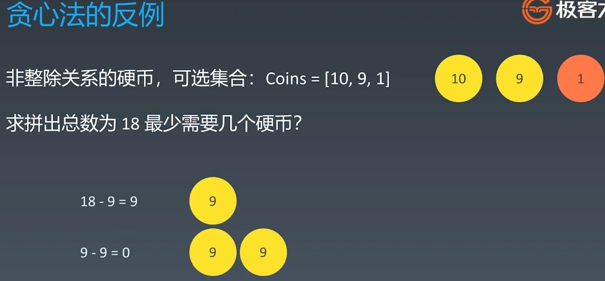
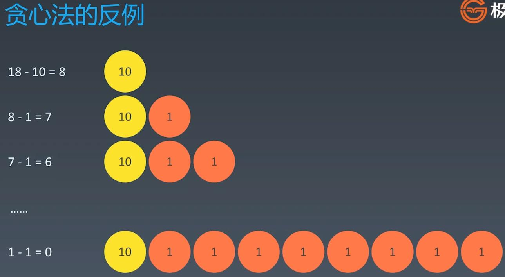

##Greed Algorithm
  
### What is Greedy Algorithm

  
  
### Usage

  
  
### EG: https://leetcode-cn.com/problems/coin-change/
### When: coins=[20, 10, 5, 1], what is the minimum combination to form: total = 36 

  
  
### but greedy is not suitable for all coins combination

  
  
### When to use greedy algorithm

