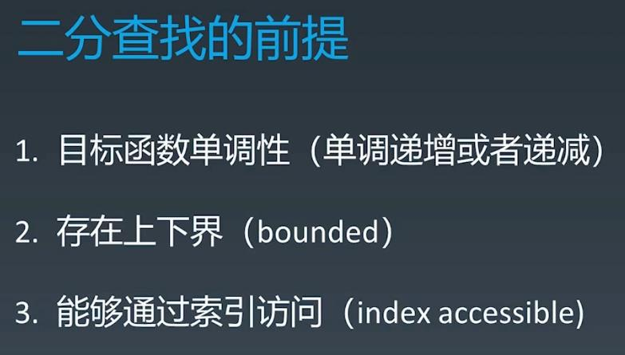
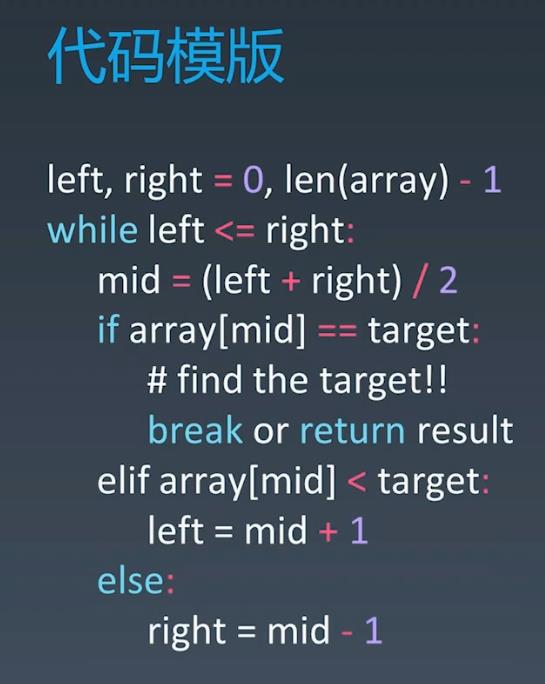

##Binary Search
###To use Binary Search, the items must be sorted otherwise it can only be traversed

  
  
###Leetcode
####69. Sqrt(x) - easy - https://leetcode.com/problems/sqrtx/
####33. Search in Rotated Sorted Array - medium - https://leetcode.com/problems/search-in-rotated-sorted-array/
####74. Search a 2D Matrix - medium - https://leetcode.com/problems/search-a-2d-matrix/
####367. Valid Perfect Square - easy - https://leetcode.com/problems/valid-perfect-square/