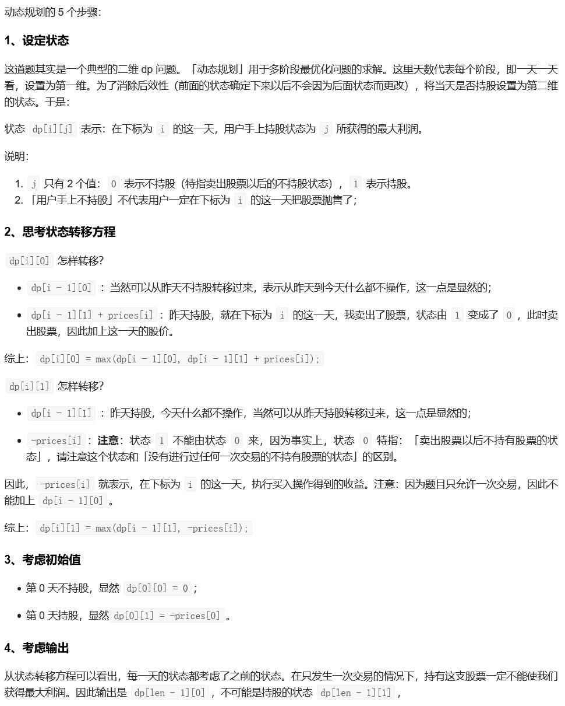
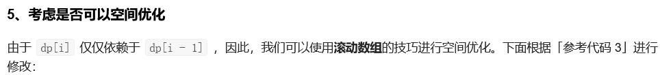

##121. Best Time to Buy and Sell Stock - easy - https://leetcode.com/problems/best-time-to-buy-and-sell-stock/
```
Say you have an array for which the ith element is the price of a given stock on day i.

If you were only permitted to complete at most one transaction (i.e., buy one and sell one share of the stock), design an algorithm to find the maximum profit.

Note that you cannot sell a stock before you buy one.

Example 1:

Input: [7,1,5,3,6,4]
Output: 5
Explanation: Buy on day 2 (price = 1) and sell on day 5 (price = 6), profit = 6-1 = 5.
             Not 7-1 = 6, as selling price needs to be larger than buying price.

Example 2:

Input: [7,6,4,3,1]
Output: 0
Explanation: In this case, no transaction is done, i.e. max profit = 0.
```
##Solution - DP

```
Time Complexity: O(n), Space Complexity: O(n)
Code:
    public int maxProfit(int[] prices) {
        if (prices == null || prices.length < 2) return 0;
        // 0：用户手上不持股所能获得的最大利润，特指卖出股票以后的不持股，非指没有进行过任何交易的不持股
        // 1：用户手上持股所能获得的最大利润

        int[][] dp = new int[prices.length][2];
        dp[0][0] = 0;
        dp[0][1] = -prices[0]; // buy the stock will spend prices[0]

        for (int i = 1; i < prices.length; i++) {
            dp[i][0] = Math.max(dp[i - 1][0], dp[i - 1][1] + prices[i]);
            // 注意：因为题目限制只能交易一次，因此状态只可能从 1 到 0，不可能从 0 到 1
            dp[i][1] = Math.max(dp[i - 1][1], -prices[i]); // because you can only buy the stock at most once
        }

        return dp[prices.length - 1][0]; // the last profitable state must be dont hold the stock
    }
```

```
Time Complexity: O(n), Space Complexity: O(1)
Code:
    public int maxProfit(int[] prices) {
        int len = prices.length;
        if (len < 2) {
            return 0;
        }

        int[] dp = new int[2];
        dp[0] = 0;
        dp[1] = -prices[0];
        for (int i = 1; i < len; i++) {
            dp[0] = Math.max(dp[0], dp[1] + prices[i]);
            dp[1] = Math.max(dp[1], -prices[i]);
        }
        return dp[0];
    }
```