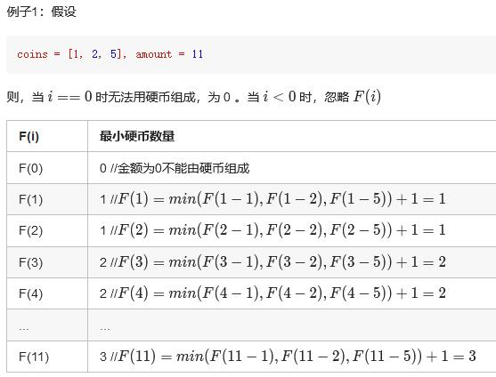

##322. Coin Change - medium - https://leetcode.com/problems/coin-change/
```
You are given coins of different denominations and a total amount of money amount. Write a function to compute the fewest number of coins that you need to make up that amount. If that amount of money cannot be made up by any combination of the coins, return -1.

Example 1:

Input: coins = [1, 2, 5], amount = 11
Output: 3 
Explanation: 11 = 5 + 5 + 1

Example 2:

Input: coins = [2], amount = 3
Output: -1

Note:
You may assume that you have an infinite number of each kind of coin.
```
##Solution 1 - DFS - Top Down
###Time Complexity: O(Sn), Space Complexity: O(S) - S is the amount, n is the number of coins
```
Code:
    public int coinChange(int[] coins, int amount) {
        if (coins.length == 0) {
            return -1;
        }

        return dfs(coins, amount, new int[amount]);
    }

    // memo[n] 表示钱币n可以被换取的最少的硬币数，不能换取就为-1
    // dfs函数的目的是为了找到 amount数量的零钱可以兑换的最少硬币数量，返回其值int
    public int dfs(int[] coins, int amount, int[] memo) {
        if (amount < 0) return -1;
        if (amount == 0) return 0;
        //retrieve from memo
        if (memo[amount - 1] != 0) {
            return memo[amount - 1];
        }
        int min = Integer.MAX_VALUE;
        for (int i = 0; i < coins.length; i++) {
            int res = dfs(coins, amount - coins[i], memo);
            if (res >= 0 && res < min) {
                min = res + 1; // 加1，是为了加上得到res结果的那个步骤中，兑换的一个硬币
            }
        }
        memo[amount - 1] = (min == Integer.MAX_VALUE ? -1 : min);
        return memo[amount - 1];
    }

```
##Solution 2 - DP - Bottom Up
###Time Complexity: O(Sn), Space Complexity: O(S) - S is the amount, n is the number of coins

```
devide into subproblems: f(n) = min(f(n-k) (k in [1, 2, 5])) + 1
Code:
    public int coinChange(int[] coins, int amount) {
        // DP: bottom up
        if (coins.length == 0) {
            return -1;
        }
        int[] result = new int[amount + 1];
        result[0] = 0;
        for (int i = 1; i <= amount; i++) {
            int min = Integer.MAX_VALUE;
            for (int j = 0; j < coins.length; j++) {
                if (i - coins[j] >= 0 && result[i - coins[j]] < min) {
                    min = result[i - coins[j]] + 1;
                }
            }
            result[i] = min;
        }

        return result[amount] == Integer.MAX_VALUE ? -1 : result[amount];
    }
```