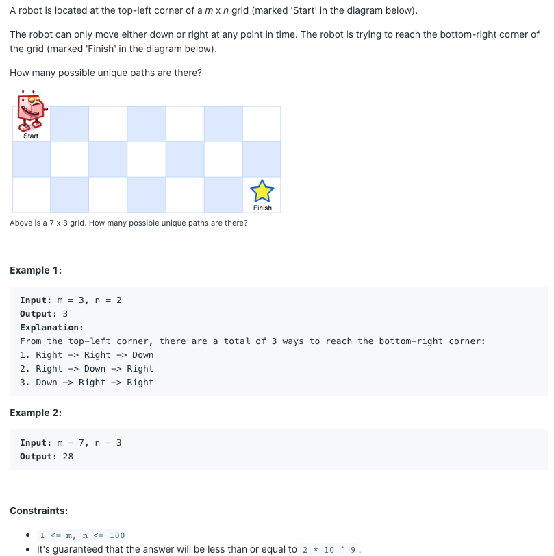
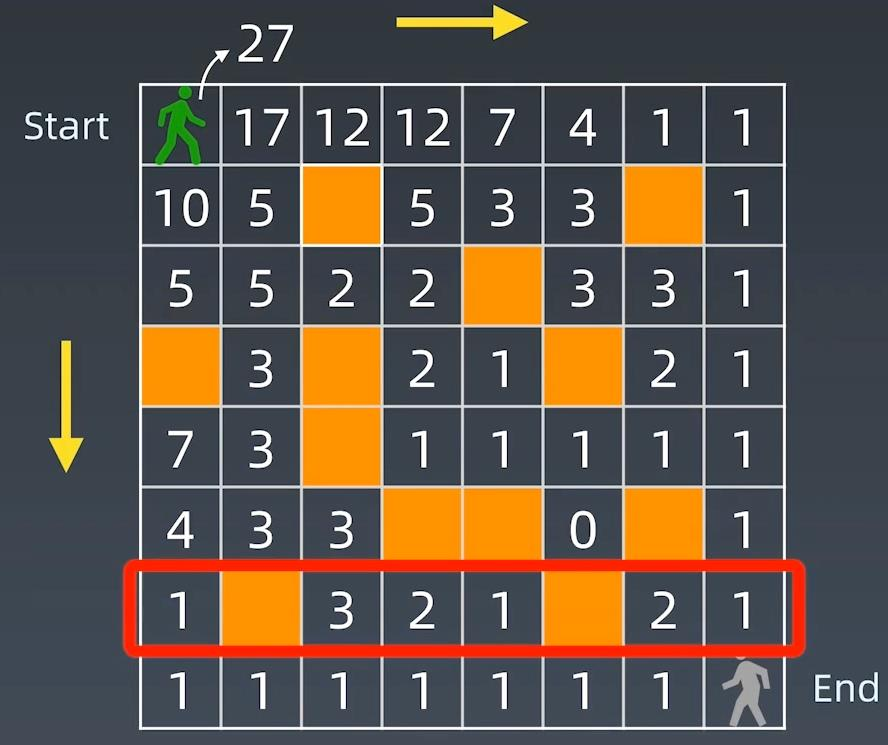
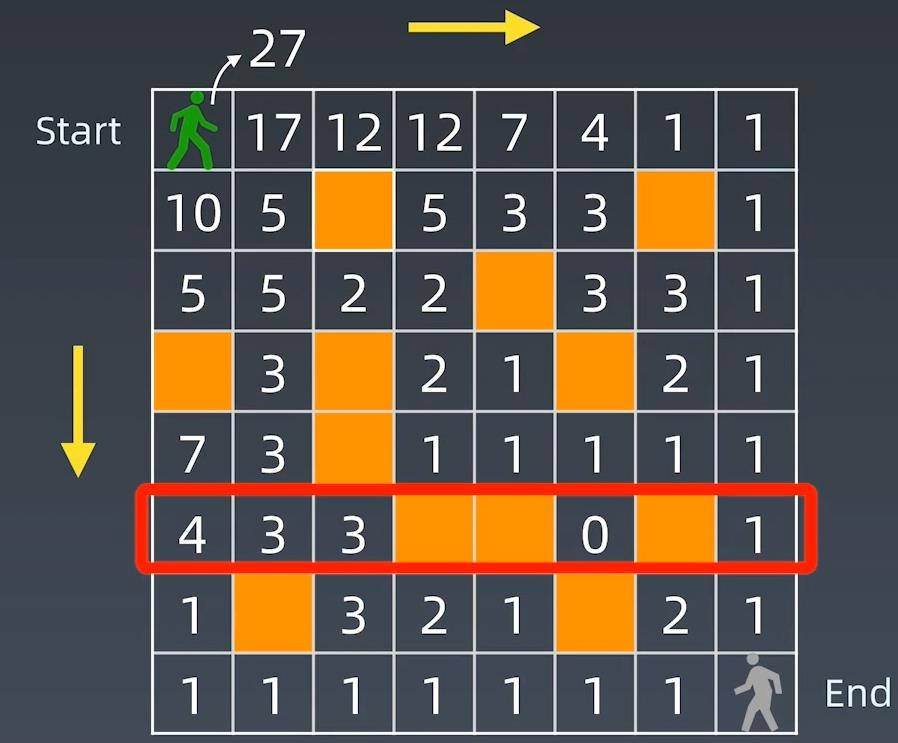
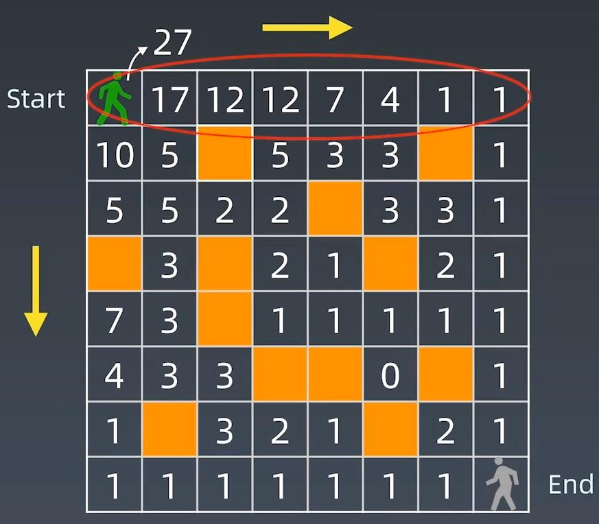

##62. Unique Paths - medium - https://leetcode.com/problems/unique-paths/

###Solution 1 - DP - Bottom Up
###Time Complexity: O(m*n), Space Complexity: O(m*n)
```
    public int uniquePaths(int m, int n) { // F(m, n) = F(m-1, n) + F(m, n-1)
        int[][] matrix = new int[m][n];
        // initialise X, Y boundary cells to be 1
        for (int i = 0; i < m; i++) matrix[i][0] = 1;
        for (int j = 0; j < n; j++) matrix[0][j] = 1;
        for (int i = 1; i < m; i++) {
            for (int j = 1; j < n; j++) {
                matrix[i][j] = matrix[i-1][j] + matrix[i][j-1];
            }
        }
        // in reality m,n is counted from 0, but in computing, it is counted from 0
        return matrix[m-1][n-1];
    }
```
###Solution 2 - DP - Bottom Up - Improved
###Time Complexity: O(m*n), Space Complexity: O(n)
###We don't have to save all the cells in the matrix(m*n), we can save space by only temporarily store one line then move up



```
    public int uniquePaths(int m, int n) {
        int[] cur = new int[n];
        Arrays.fill(cur,1);
        for (int i = 1; i < m;i++){
            for (int j = 1; j < n; j++){
                cur[j] += cur[j-1] ;
            }
        }
        return cur[n-1];
    }
```