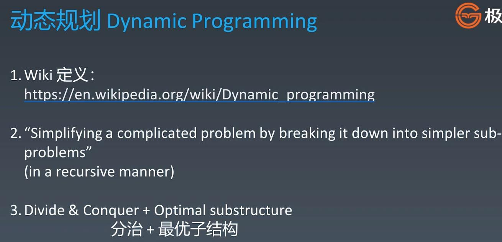
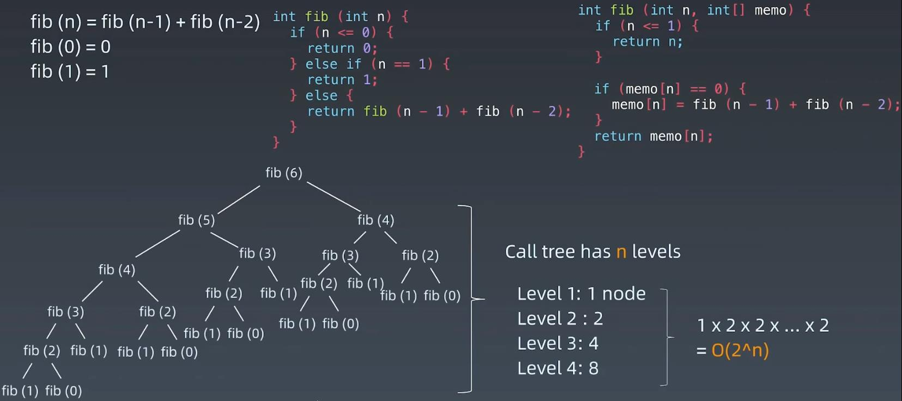
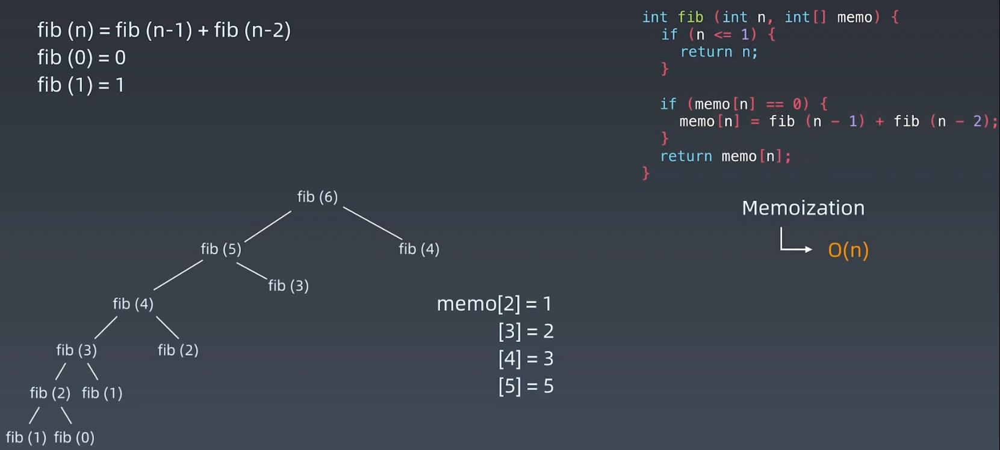
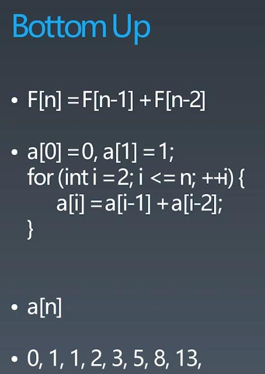
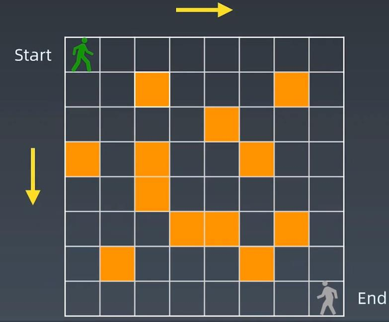
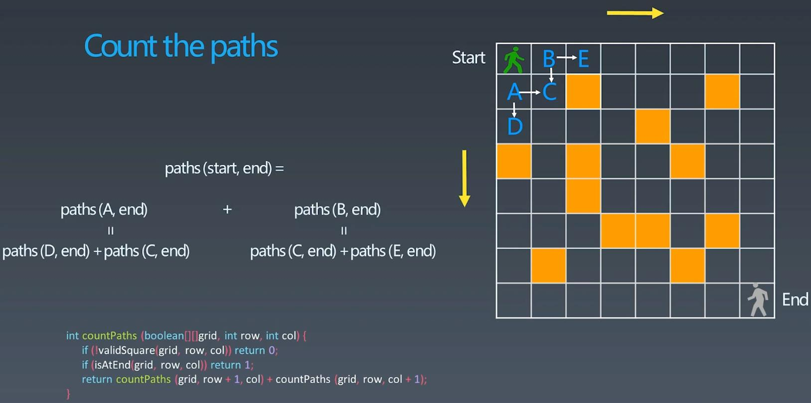
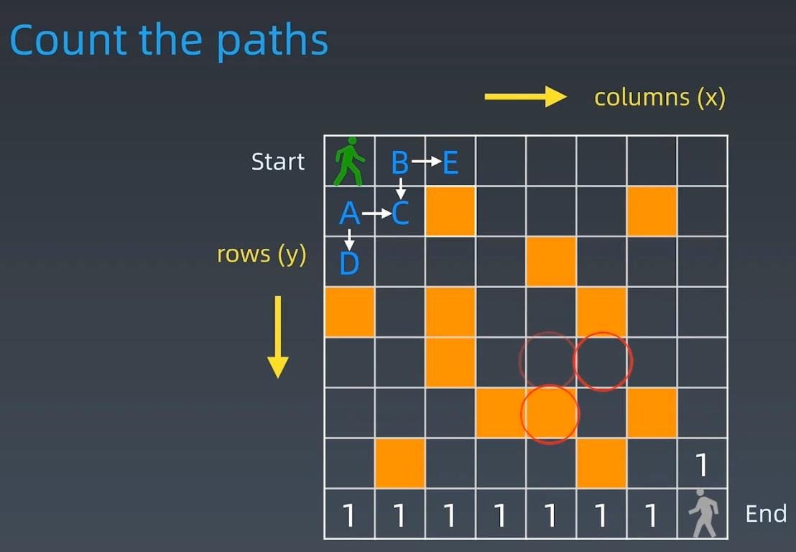
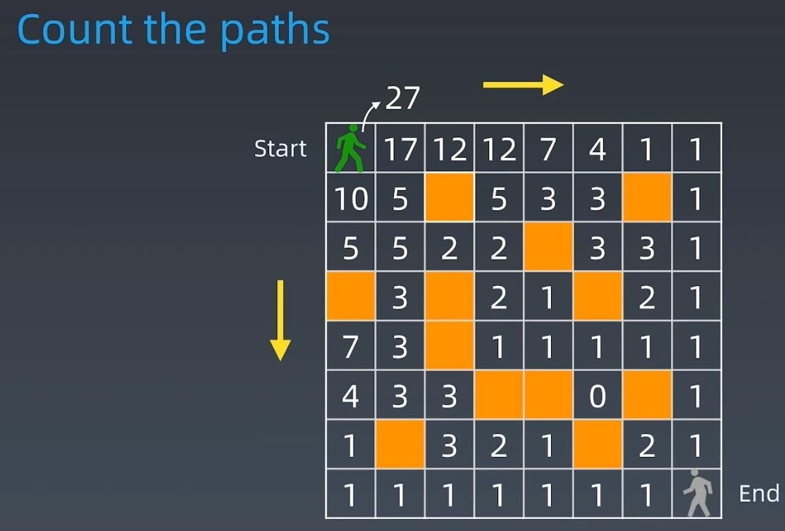
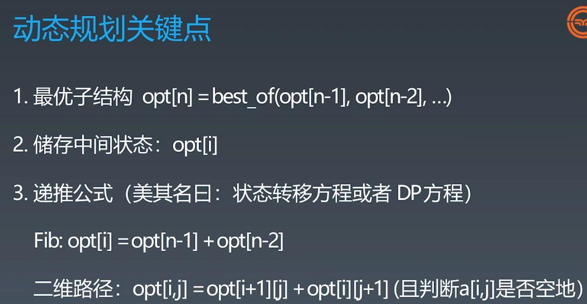

##Dynamic Programming


###How to resolve - DP
```
First: find the repeatability(divice)
Second: define state array - one dimension or two dimensions
Third: write down: DP Equation
```
###Example 1 - Fibonacci
###Solution 1: Simple recursion will calculate lots of repeated value, time complexity: O(2^N)

###Solution 2 - Add memorization for each value will eliminate repeated value, time complexity: O(N)

###Solution 3 - Bottom Up(iteration): f(0), f(1), f(0) + f(1) => f(2),..., f(n-2) + f(n-1) = f(n) 
###recursion is Top Down(D): f(n) = f(n-1) + f(n-2), f(n-1) = f(n-2) + f(n-3) ...

<br></br>
<br></br>
###Example 2 - Count the paths

###Solution 1: Divide + Memorization

###Solution 2: Dynamic Programming - program from the end to the top

### the paths to get to O(x, y) = O(x+1, y) + O(x, y+1), when meet the stone or hit the boundary O(x, y) = 0

### DP Summary

<br></br>
<br></br>
### Leetcode:
####53. Maximum Subarray - easy - https://leetcode.com/problems/maximum-subarray/
####62. Unique Paths - medium - https://leetcode.com/problems/unique-paths/
####120. Triangle - medium - https://leetcode.com/problems/triangle/
####121. Best Time to Buy and Sell Stock - easy - https://leetcode.com/problems/best-time-to-buy-and-sell-stock/
####152. Maximum Product Subarray - medium - https://leetcode.com/problems/maximum-product-subarray/
####198. House Robber - easy - https://leetcode.com/problems/house-robber/
####322. Coin Change - medium - https://leetcode.com/problems/coin-change/
####1143. Longest Common Subsequence - medium - http://leetcode.com/problems/longest-common-subsequence/