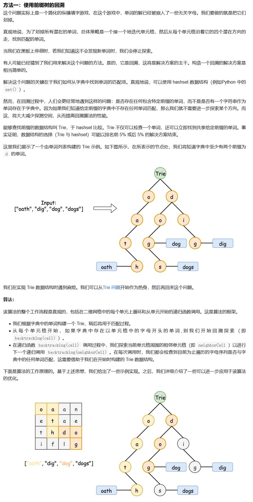

##212. Word Search II - hard - https://leetcode.com/problems/word-search-ii/
```
Given a 2D board and a list of words from the dictionary, find all words in the board.

Each word must be constructed from letters of sequentially adjacent cell, where "adjacent" cells are those horizontally or vertically neighboring. The same letter cell may not be used more than once in a word.

 

Example:

Input: 
board = [
  ['o','a','a','n'],
  ['e','t','a','e'],
  ['i','h','k','r'],
  ['i','f','l','v']
]
words = ["oath","pea","eat","rain"]

Output: ["eat","oath"]

 

Note:

    All inputs are consist of lowercase letters a-z.
    The values of words are distinct.
提示:

    你需要优化回溯算法以通过更大数据量的测试。你能否早点停止回溯？
    如果当前单词不存在于所有单词的前缀中，则可以立即停止回溯。什么样的数据结构可以有效地执行这样的操作？散列表是否可行？为什么？ 前缀树如何？如果你想学习如何实现一个基本的前缀树，请先查看这个问题： 实现Trie（前缀树）。
```
###Solution - Trie with Back Track

```
Code:
    public List<String> findWords(char[][] board, String[] words) {
        Trie trie = new Trie();
        List<String> result = new ArrayList<>();
        // save all words into trie
        for (String word : words) {
            trie.insert(word);
        }
        if (board.length == 0) return result;
        //traverse from each cell, suppose the number of cells in each row is the same
        for (int i = 0; i < board.length; i++) {
            for (int j = 0; j < board[0].length; j++) {
                dfs_backtrack(board, i, j, trie.root, result);
            }
        }
        return result;
    }

    private void dfs_backtrack(char[][] board, int row, int col, TrieNode node, List<String> result) {
        // terminator
        if (row < 0 || row >= board.length || col < 0 || col >= board[0].length) return;
        char cur = board[row][col]; // current char
        //if cur has been traversed or cannot find it in the Trie, return
        if (cur == '$' || node.children[cur - 'a'] == null) return;

        node = node.children[cur - 'a'];
        // if node is the end of a word
        if (node.word != null) {
            result.add(node.word);
            //remove the word
            node.word = null;
        }
        // set current cell as traversed
        board[row][col] = '$';
        // traverse to four ways
        dfs_backtrack(board, row - 1, col, node, result);
        dfs_backtrack(board, row + 1, col, node, result);
        dfs_backtrack(board, row, col - 1, node, result);
        dfs_backtrack(board, row, col + 1, node, result);

        //set back state
        board[row][col] = cur;
    }

    class TrieNode {
        public TrieNode[] children;
        public String word; // store current word has been found

        public TrieNode() {
            children = new TrieNode[26];
            word = null;
            for (int i = 0; i < 26; i++) {
                //initialize with null
                children[i] = null;
            }
        }
    }

    class Trie {
        TrieNode root;

        public Trie() {
            root = new TrieNode();
        }

        /* insert a word into the trie */
        public void insert(String word) {
            TrieNode node = root;
            for (char ch : word.toCharArray()) {
                if (node.children[ch - 'a'] == null) {
                    node.children[ch - 'a'] = new TrieNode();
                }
                node = node.children[ch - 'a'];
            }
            // save word in to leaf node
            node.word = word;
        }
    }
```