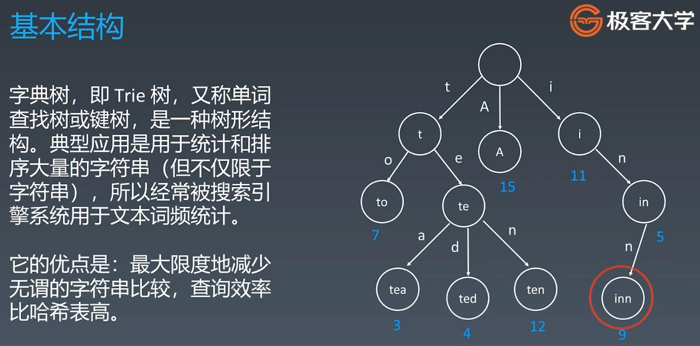
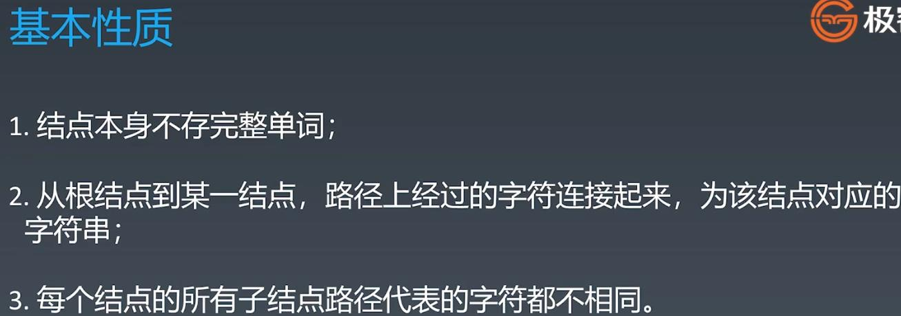
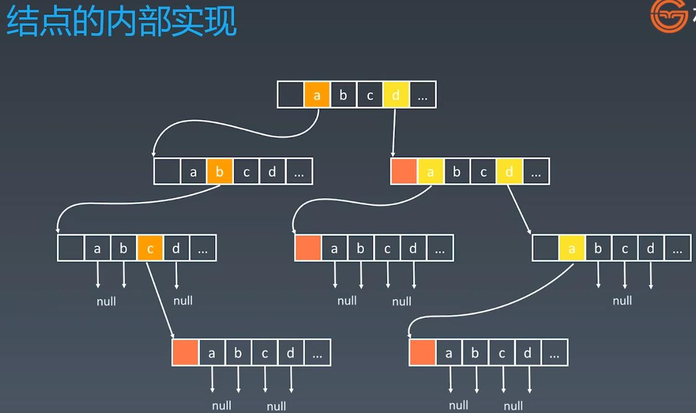
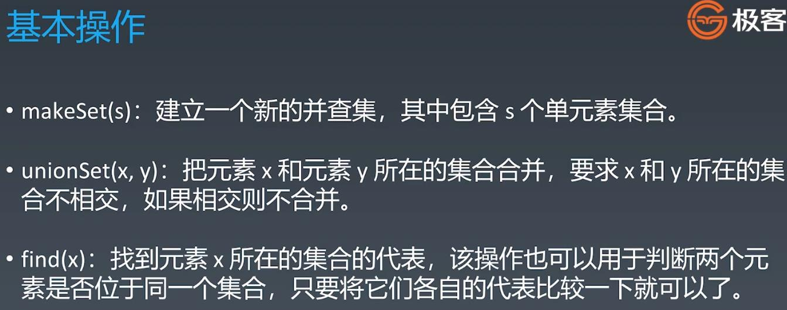
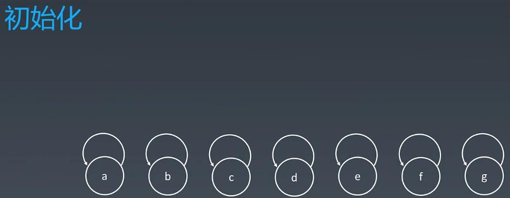
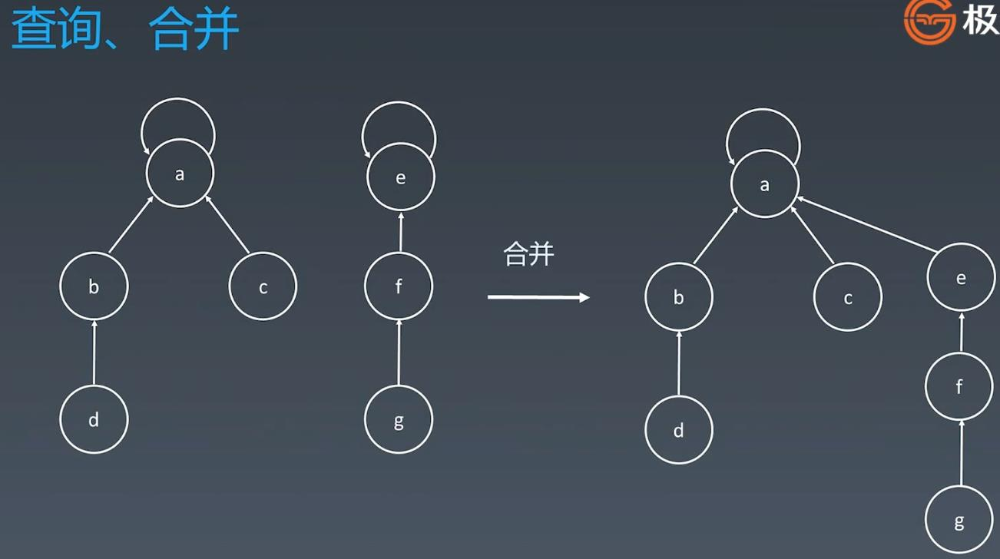
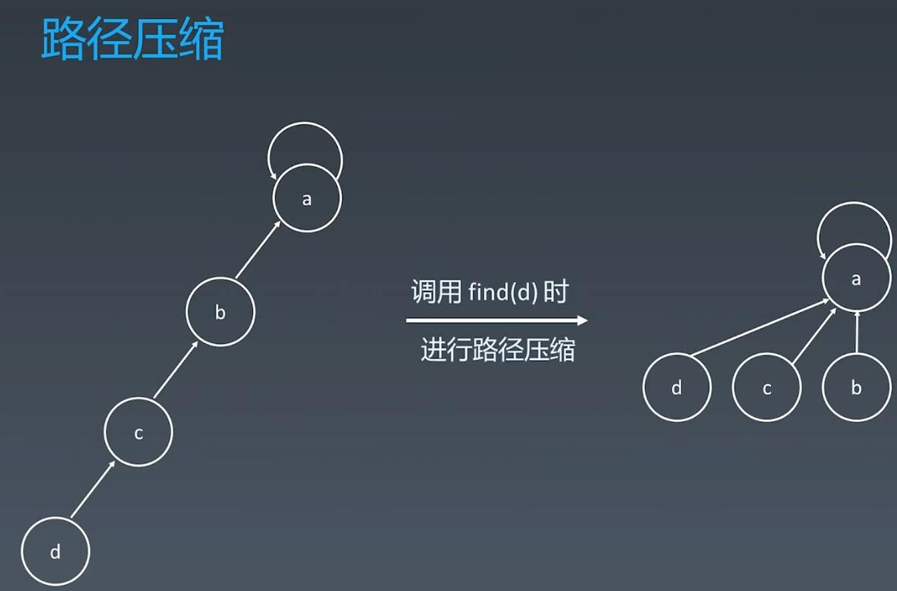

##Trie & Disjoint Sets(Union-Find)
##Trie(字典树)

###每个节点可能存储额外的信息，例如单词搜频率


##Disjoint Sets(并查集) - Group or not?(组团，配对的问题)

###initialize each element with parent element as itself

###Search and Combine

###Can optimize search by path compression

```
Code Sample:
    class UnionFind{
        private int count = 0;
        private int[] parent;
        public UnionFind(int n){
            count = n;
            parent = new int[n];
            for(int i = 0;i<n;i++){
                parent[i] = i;
            }
        }

        // find top parent(the root) which is parent[i] = i
        public int find(int p){
            while(p!=parent[p]){
                // path compression
                parent[p] = parent[parent[p]];
                p = parent[p];
            }
            return p;
        }

        public void union(int p , int q){
            int rootP = find(p);
            int rootQ = find(q);
            if(rootP == rootQ) return;
            parent[rootP] = rootQ;
            //the number independent sets will minus -1
            count--;
        }
    }
```
