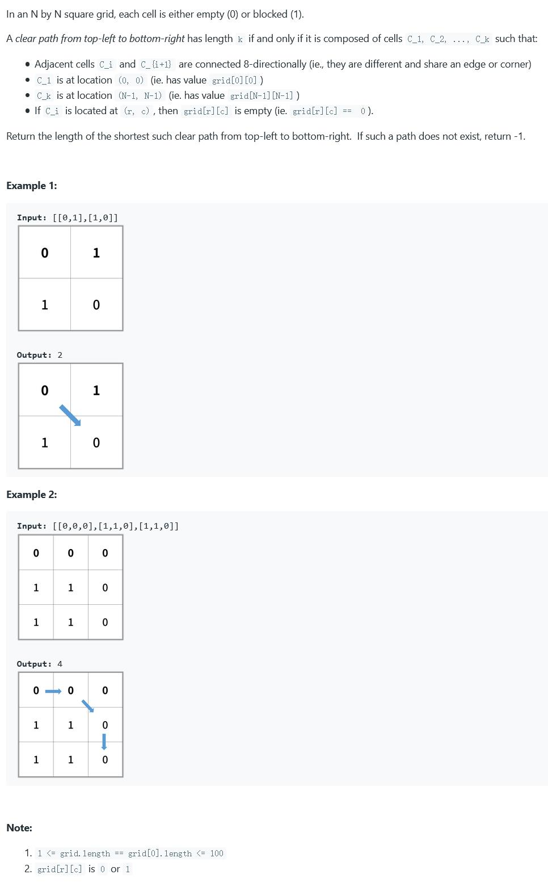

##1091. Shortest Path in Binary Matrix - medium -  https://leetcode.com/problems/shortest-path-in-binary-matrix/

###Solution - Heuristic Search(A*) or (BFS & PriorityQueue)
####Time Complexity: <= O(N) - N is the number cells in the grid 
```
Code: 
    public int shortestPathBinaryMatrix(int[][] grid) {
        int gridLen = grid.length;
        if (grid[0][0] == 1 || grid[gridLen - 1][gridLen - 1] == 1) return -1;
        if (gridLen == 1) return 1;

        //direction each cell can go
        int[][] dir = {{-1, 0}, {1, 0}, {0, -1}, {0, 1}, {-1, 1}, {-1, -1}, {1, -1}, {1, 1}};

        //use grid to track each step, e.g: the first cell's step is 1
        GridCell start = new GridCell(0, 0, grid[0][0] = 1, gridLen);

        PriorityQueue<GridCell> queue = new PriorityQueue<>();
        queue.offer(start);

        while (!queue.isEmpty()) {
            GridCell cell = queue.poll();
            int step = grid[cell.x][cell.y];

            //traverse all direction
            for (int[] d : dir) {
                int x = cell.x + d[0];
                int y = cell.y + d[1];
                //terminator: hit the end cell(right-bottom cell)
                if (x == gridLen - 1 && y == gridLen - 1) return step + 1;
                //hit boundary
                if (x < 0 || x >= gridLen || y < 0 || y >= gridLen) continue;
                //hit stone or already visited
                if (grid[x][y] != 0 && grid[x][y] <= step + 1) continue;
                GridCell next = new GridCell(x, y, grid[x][y] = step + 1, gridLen);
                queue.offer(next);
            }
        }
        return -1;
    }

    class GridCell implements Comparable<GridCell> {
        int x, y;
        int power; // f is priority power
        int gridLen;

        public GridCell(int x, int y, int step, int gridLen) {
            this.x = x;
            this.y = y;
            this.gridLen = gridLen;
            int distance = Math.max(gridLen - 1 - x, gridLen - 1 - y);
            this.power = distance + step;
        }

        @Override
        public int compareTo(GridCell o) {
            return this.power - o.power;
        }

        @Override
        public boolean equals(Object obj) {
            if (this == obj) return true;
            if (!(obj instanceof GridCell)) return false;
            GridCell cell = (GridCell) obj;
            return this.x == cell.x && this.y == cell.y;
        }

        @Override
        public int hashCode() {
            return Integer.hashCode(x * gridLen + y);
        }
    }
```