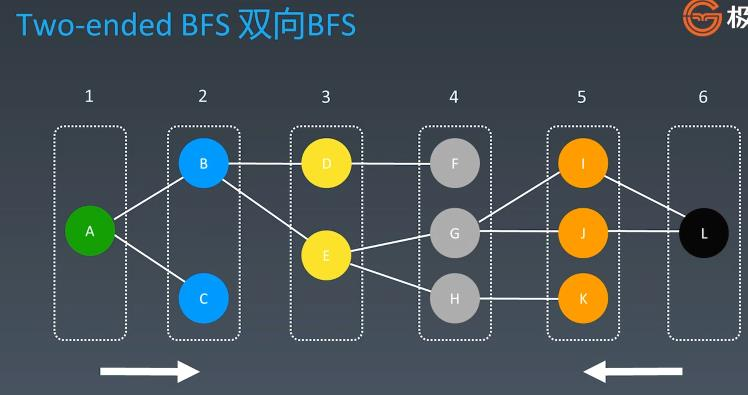

##Primitive Search(Simple Search)

##Think Search as a State Tree - E.g: Coins Change, coins($1, $2, $5) to form $11

##Tree Pruning - E.g: Fibanacci, memorization is a way of pruning

###Think about tree state of Tic_Tac_Toe game

###Why Tree Pruning? - the depth and width of the tree can be extremely huge 
####The difficulty is the depth of the tree and hwo to prune. The depth of chess is 37, and every level there are 10 ways

####the complexity is: 10^37, because pruning has been overcome, the chess is defeated by Deep Blue in 1996 

###Backtrack is used a lot when playing chess game, but human brain is unable to backtrack deep depth.

###Leetcode
####70. Climbing Stairs - easy - https://leetcode.com/problems/climbing-stairs/
####22. Generate Parentheses - Medium -- https://leetcode.com/problems/generate-parentheses/
####51. N-Queens - hard - https://leetcode.com/problems/n-queens/
####36. Valid Sudoku - medium - https://leetcode.com/problems/valid-sudoku/
####37. Sudoku Solver - hard - https://leetcode.com/problems/sudoku-solver/
  
  
###BFS

###Two-Ended BFS

###Leetcode
####127. Word Ladder - medium - https://leetcode.com/problems/word-ladder/
####126. Word Ladder II - hard - https://leetcode.com/problems/word-ladder-ii/
  
  
###Heuristic Search(A*) - 启发式搜索
####BFS can be improved 

####Improve BFS by using something more intelligent - Priority Queue(with priority function)

####Example: Shorted Path - (Evaluation Function: e.g: Manhattan Distance)

  
###Leetcode
####36. Valid Sudoku - medium - https://leetcode.com/problems/valid-sudoku/
####37. Sudoku Solver - hard - https://leetcode.com/problems/sudoku-solver/
####127. Word Ladder - medium - https://leetcode-cn.com/problems/word-ladder/
####773. Sliding Puzzle - hard - https://leetcode.com/problems/sliding-puzzle/
####1091. Shortest Path in Binary Matrix - medium -  https://leetcode.com/problems/shortest-path-in-binary-matrix/