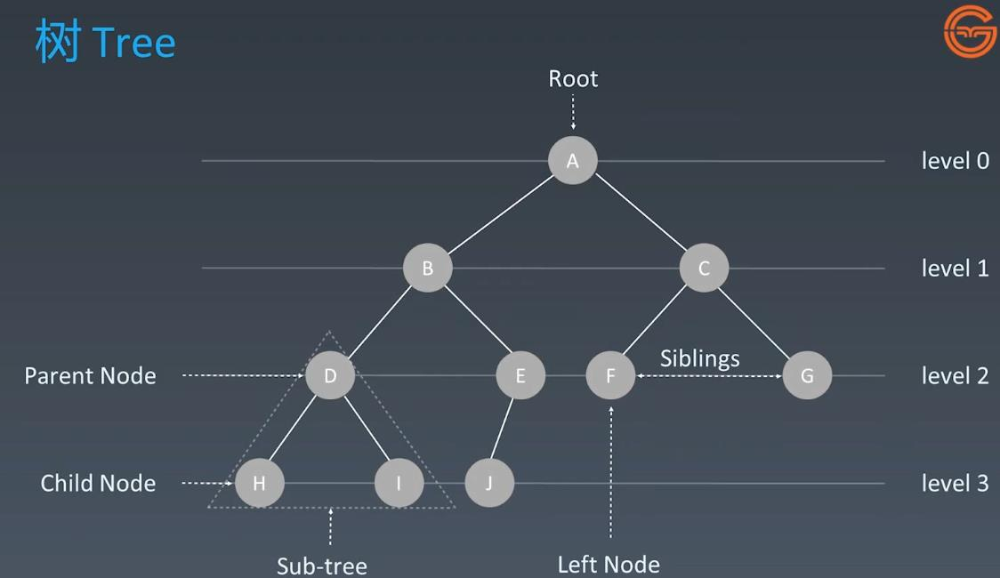
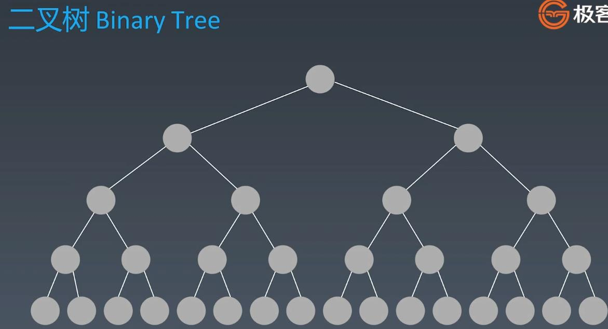
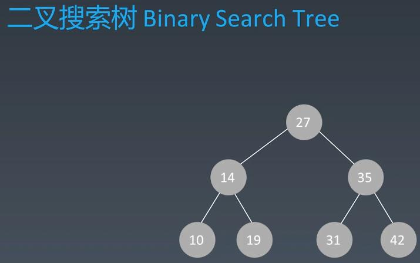
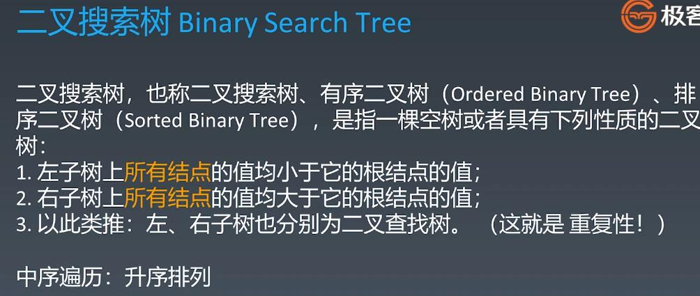

##AVL Tree & Black-Red Tree
<br></br>
<br></br>
###Tree

<br></br>
###Binary Tree

####Binary Tree Traversal:
#####Pre-order: root - left - right
#####In-order: left - root - right
#####Pre-order: left - right - root
```
Template:
def preorder(self, root):
    if root:
        self.traverse_path.append(root.val)
        self.preorder(root.left)
        self.preorder(root.right)

def inorder(self, root):
    if root:
        self.inorder(root.left)
        self.traverse_path.append(root.val)
        self.inorder(root.right)

def postorder(self, root):
    if root:
        self.postorder(root.left)
        self.postorder(root.right)
        self.traverse_path.append(root.val)
```
<br></br>
###Binary Search Tree(balance binary tree)

