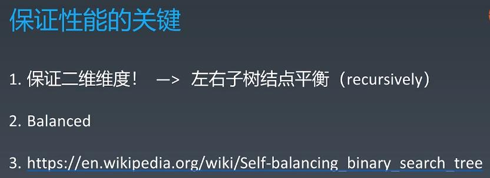
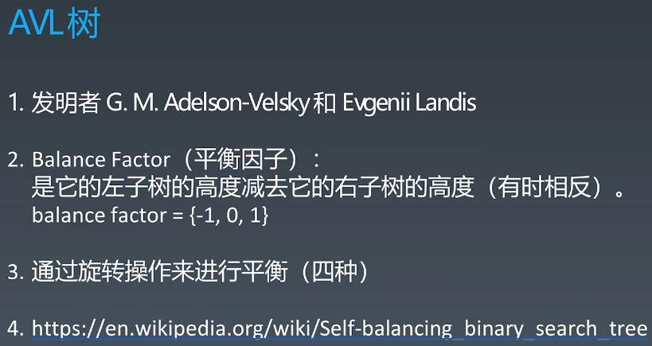
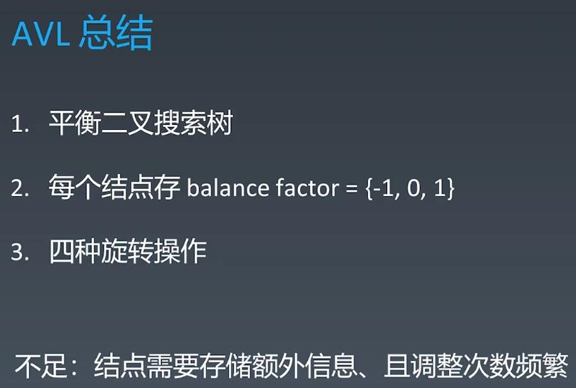
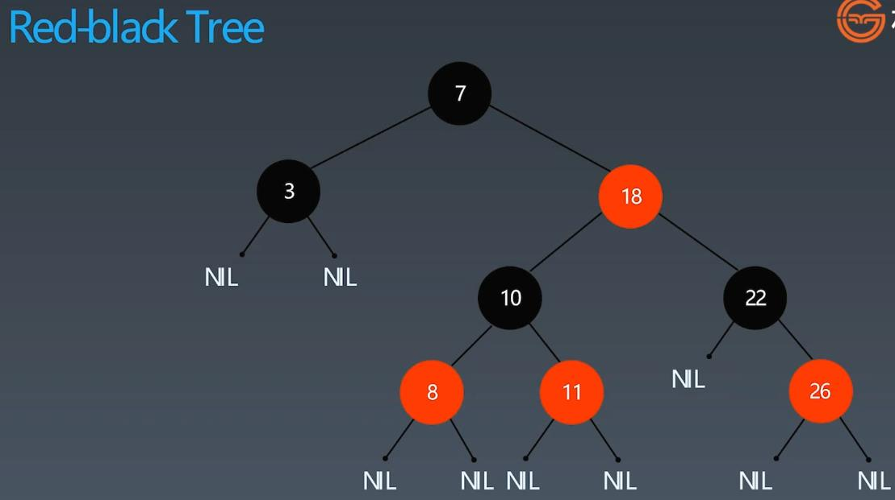
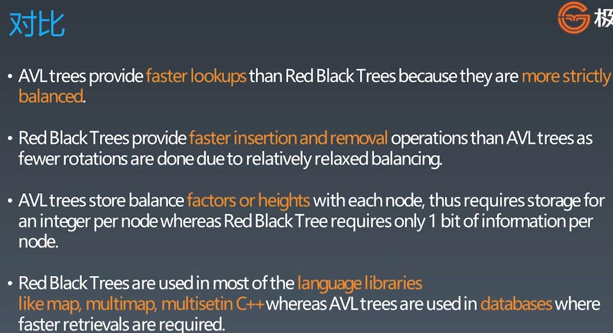

##AVL Tree & Black-Red Tree
<br></br>
<br></br>
###Tree

<br></br>
###Binary Tree

####Binary Tree Traversal:
#####Pre-order: root - left - right
#####In-order: left - root - right
#####Pre-order: left - right - root
```
Template:
def preorder(self, root):
    if root:
        self.traverse_path.append(root.val)
        self.preorder(root.left)
        self.preorder(root.right)

def inorder(self, root):
    if root:
        self.inorder(root.left)
        self.traverse_path.append(root.val)
        self.inorder(root.right)

def postorder(self, root):
    if root:
        self.postorder(root.left)
        self.postorder(root.right)
        self.traverse_path.append(root.val)
```
<br></br>
###Binary Search Tree


####When binary search tree is not correct inserted(unbalanced), it will become a linked list

###Self-balancing Binary Search Tree: 2-3 Tree, AVL Tree, Red-Black Tree, B-Tree ...

<br></br>
<br></br>
###AVL Tree - the search performance depends on the depth of the tree => balance factor = depth difference
<br></br>
###E.g: the root node balance factor = left height - right height = +1

####E.g: add 3 into the AVL tree -> unbalanced -> have to rotate the tree to make balance


####Rotate the tree - be careful about how sub-node moves

###AVL Summary - drawback: High Maintenance => introduce Approximately-balanced binary tree, less maintenance

<br></br>
<br></br>
###Black-Red Tree(Approximately-balanced binary search tree)


###AVL vs Black-End Tree

