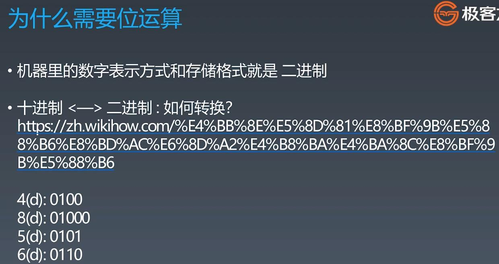
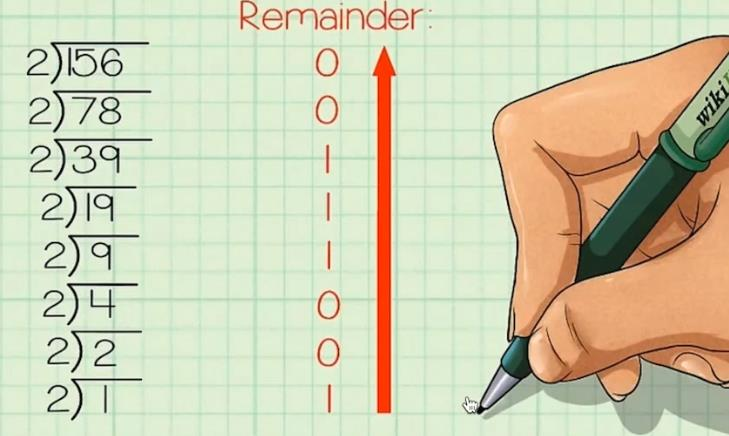
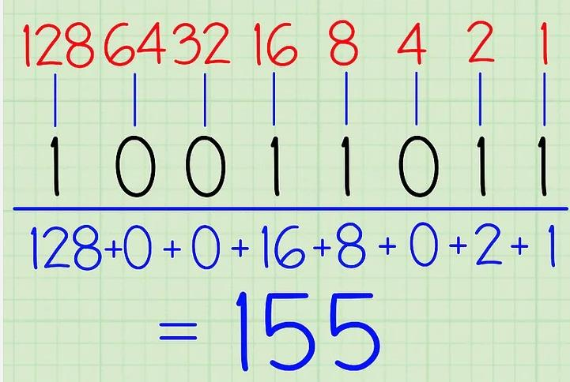
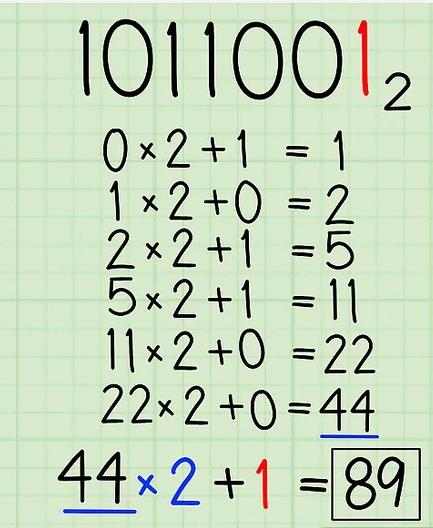

##Bit Operation

###How to convert decimal to binary number -> Performing Short Division by Two with Remainder

###How to convert binary to decimal number -> Positional Notation or Use Doubling
 OR   
  
###Bit Operation: 3 * 2 => 3 << 1, 6 / 2 => 6 >> 1

####1s(全1 - all 1)

####Note: x&1 => get the last bit; x&(-x) => get the last 1

###why n & (n-1) will remove the last 1

  
###Leetcode
####191. Number of 1 Bits - easy - https://leetcode.com/problems/number-of-1-bits/
####231. Power of Two - easy - https://leetcode.com/problems/power-of-two/
####190. Reverse Bits - easy - https://leetcode.com/problems/reverse-bits/
####338. Counting Bits - medium - https://leetcode.com/problems/counting-bits/
####51. N-Queens - hard - https://leetcode.com/problems/n-queens/
####52. N-Queens II - hard - https://leetcode.com/problems/n-queens-ii/

