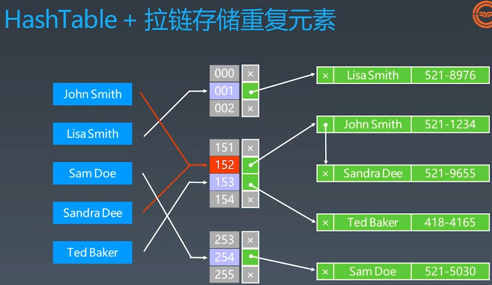
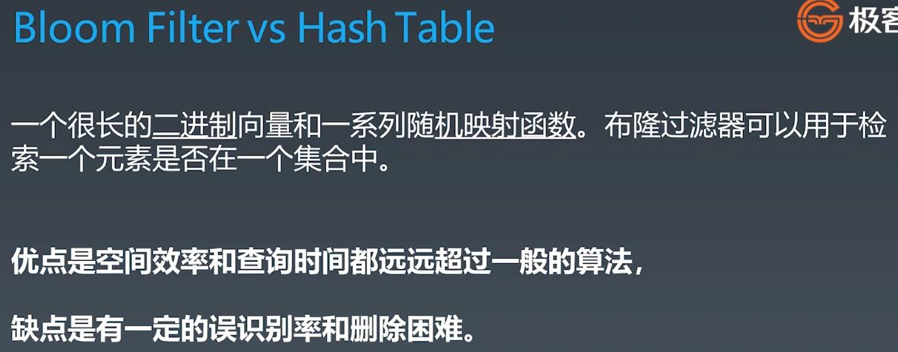
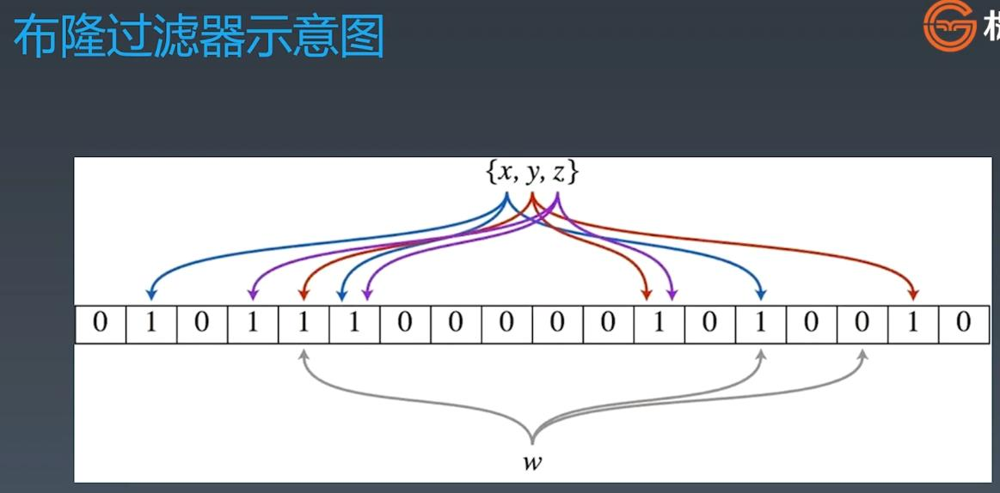
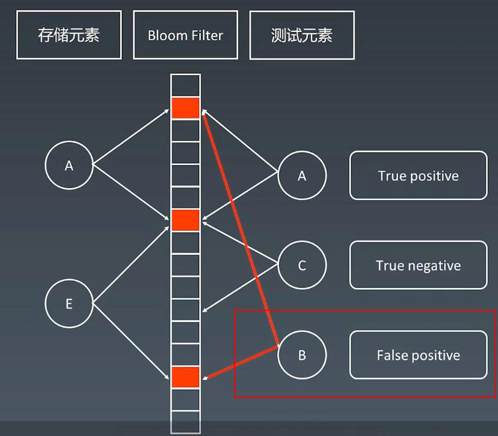
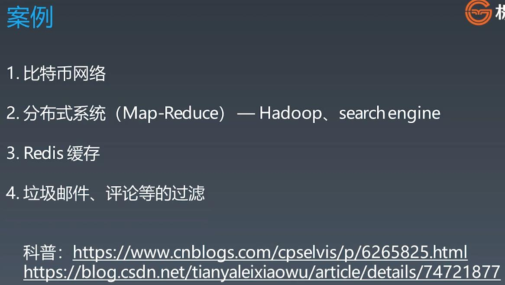
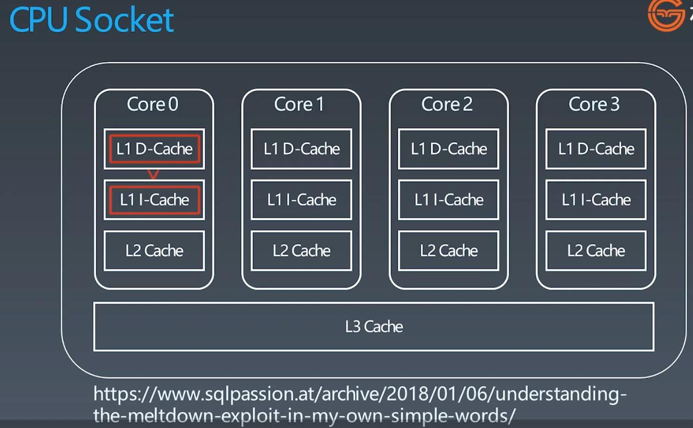
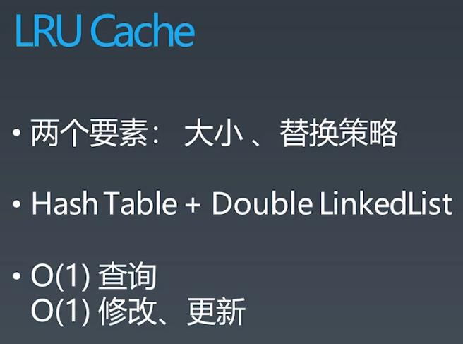
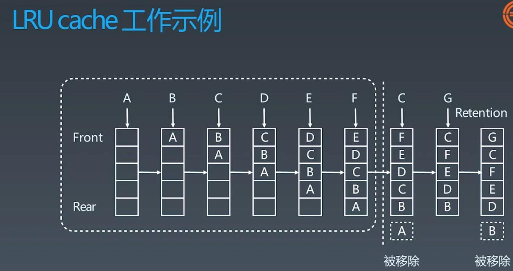
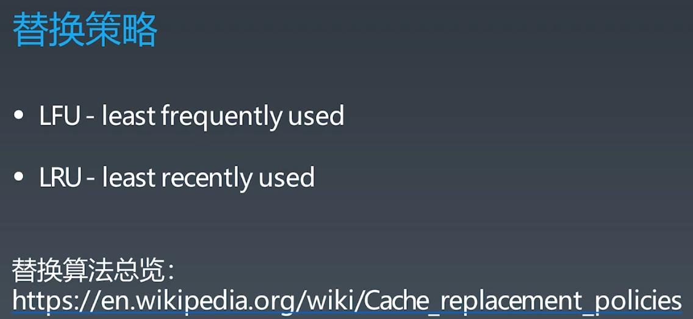

##Bloom Filter, LRU Cache
  
###Traditional Way of Hash Table Storage

  
###Bloom filter is an advanced search which only tells if element may exists or not exists
###it is only used in the most-outer layer as a quick search cache

###Bloom filter uses bits to store info

###When find a item in the bloom filter which means it may exist, if not found means it is not in the filter 100%, in reality, if bloom filter find the search item, then the system will continue to search in the DB or other storage system
###E.g: When A, E is inserted, search B might be false positive 

###Bloom filter usage

###Simple Bloom Filter Implementation: 
###https://github.com/lovasoa/bloomfilter/blob/master/src/main/java/BloomFilter.java
###https://github.com/Baqend/Orestes-Bloomfilter
  
  
##LRU Cache (LRU - least recently used)

###LRU Cache Implementation - HashTable + Double LinkedList

###LRU Cache Insert - How does it work - insert A -> B -> C -> D -> E -> F -> C -> G

###Cache Replacement Policies: FIFO, LIFO, LRU ...; refer: https://en.wikipedia.org/wiki/Cache_replacement_policies

  
###Leetcode
####146. LRU Cache - medium - https://leetcode.com/problems/lru-cache/