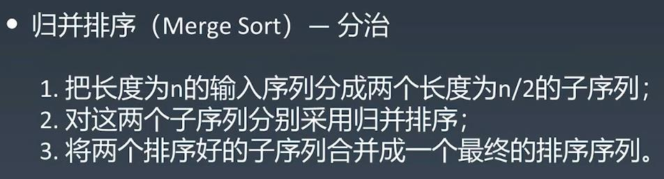
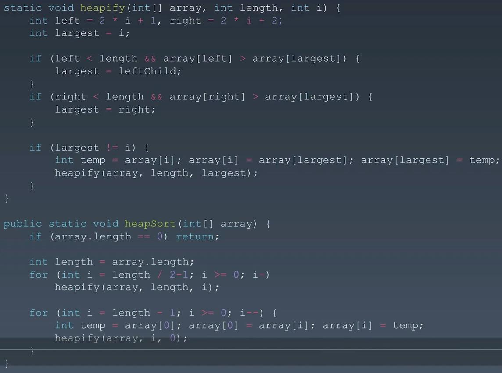

##Sorting Algorithm
####https://www.cnblogs.com/onepixel/p/7674659.html
####https://www.bilibili.com/video/av25136272
####https://www.bilibili.com/video/av63851336
  
###Sorting Algorithm - Classfication

###Sorting Complexity Comparison (pay attention to sorting with nlogn complexity)

  
## Elementary Sorting Algorithms - Time Complexity:O(n^2)

  
## Advanced Sorting
###Quick Sort

###Merge Sort

###Quick Sort vs Merge Sort

  
##Heap Sort

  
##Special Sorting

