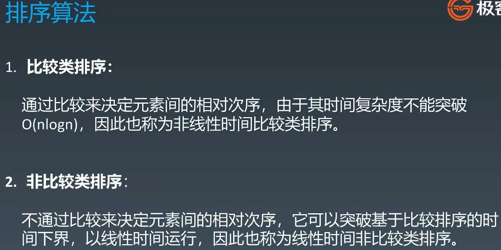
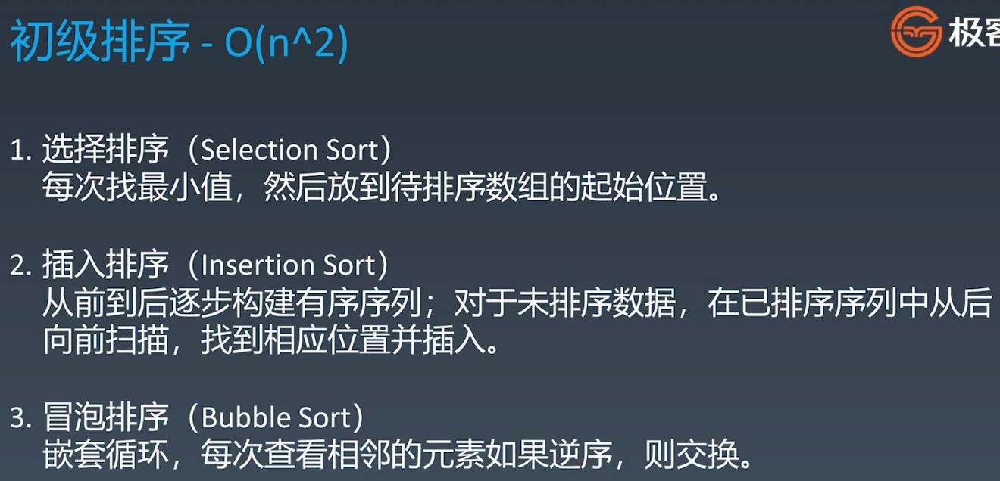
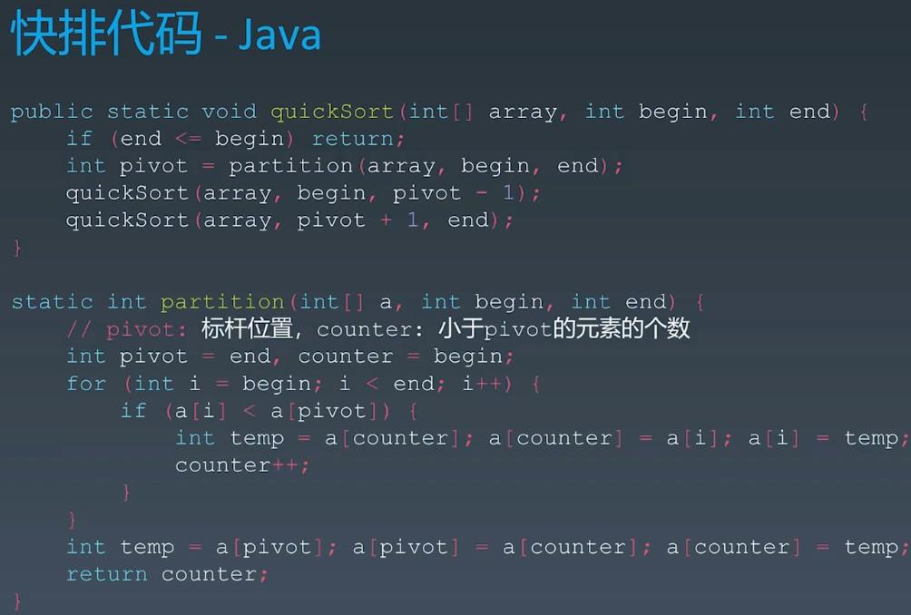
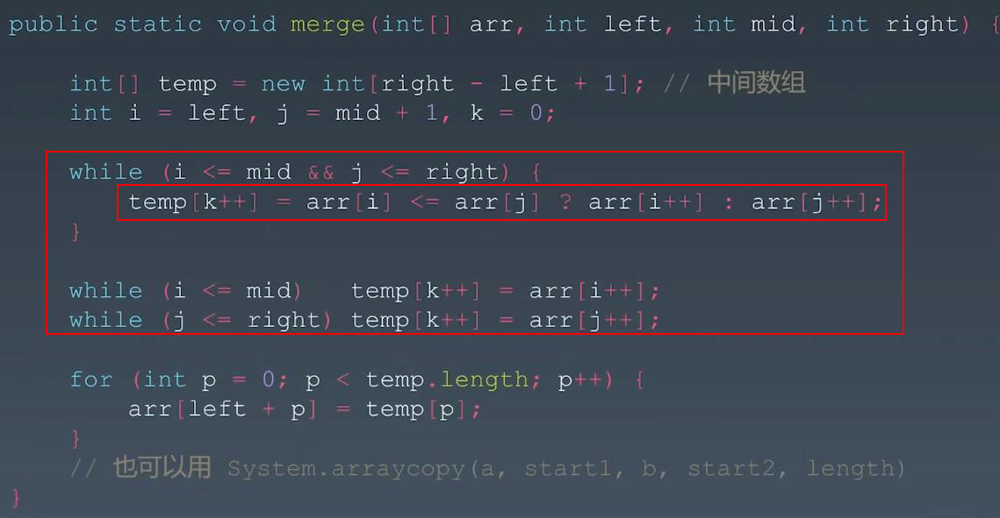

##Sorting Algorithm - Reading
####https://www.cnblogs.com/onepixel/p/7674659.html - 十大经典排序算法（动图演示）
####https://www.bilibili.com/video/av25136272       - 简单明了, 9种经典排序算法可视化动画
####https://www.bilibili.com/video/av63851336       - 6分钟看完15种排序算法动画展示
<br></br>
###Sorting Algorithm - Classfication


###Sorting Complexity (Very familiar with O(N logN) - Sorting: Quick Sorting, Merge Sorting, Heap Sorting)

<br></br>
## Elementary Sorting Algorithms - Time Complexity:O(n^2)

<br></br>
## Advanced Sorting
###Quick Sort
###快速排序使用分治法来把一个串（list）分为两个子串（sub-lists）。具体算法描述如下：
####1. 从数列中挑出一个元素，称为 “基准”（pivot）；
####2. 重新排序数列，所有元素比基准值小的摆放在基准前面，所有元素比基准值大的摆在基准的后面（相同的数可以到任一边）。在这个分区退出之后，该基准就处于数列的中间位置。这个称为分区（partition）操作；
####3. 递归地（recursive）把小于基准值元素的子数列和大于基准值元素的子数列排序。


###Merge Sort
###归并排序是建立在归并操作上的一种有效的排序算法。该算法是采用分治法（Divide and Conquer）的一个非常典型的应用。
###将已有序的子序列合并，得到完全有序的序列；即先使每个子序列有序，再使子序列段间有序。若将两个有序表合并成一个有序表，称为2-路归并:
####1.把长度为n的输入序列分成两个长度为n/2的子序列；
####2.对这两个子序列分别采用归并排序；
####3.将两个排序好的子序列合并成一个最终的排序序列。


####Note: Three While Loops to merge 2 sorted arrays
####First while loop => when the first while loop is finished: i or j index will be finished
####The rest two while loops => if i is not finished put the rest of i arrays into temp or if j is not finished...

###Quick Sort vs Merge Sort

<br></br>
##Heap Sort - We can use priority queue instead of self-defined heap
```
    public void sort(int arr[]) {
        int n = arr.length;

        // Build heap (rearrange array)
        for (int i = n / 2 - 1; i >= 0; i--)
            heapify(arr, n, i);

        // One by one extract an element from heap
        for (int i = n - 1; i >= 0; i--) {
            // Move current root to end
            int temp = arr[0];
            arr[0] = arr[i];
            arr[i] = temp;

            // call max heapify on the reduced heap
            heapify(arr, i, 0);
        }
    }

    // To heapify a subtree rooted with node i which is
    // an index in arr[]. n is size of heap
    void heapify(int arr[], int length, int i) {
        int largest = i;  // Initialize largest as root
        int left = 2 * i + 1, right = 2 * i + 2;  

        // If left child is larger than root
        if (left < length && arr[left] > arr[largest])
            largest = left;

        // If right child is larger than largest so far
        if (right < length && arr[right] > arr[largest])
            largest = right;

        // If largest is not root
        if (largest != i) {
            int swap = arr[i];
            arr[i] = arr[largest];
            arr[largest] = swap;

            // Recursively heapify the affected sub-tree
            heapify(arr, length, largest);
        }
    }
```
<br></br>
##Special Sorting

<br></br>
###Leetcode:
####1122. Relative Sort Array - easy - https://leetcode.com/problems/relative-sort-array/
####242. Valid Anagram - easy - https://leetcode.com/problems/valid-anagram/
####https://leetcode-cn.com/problems/design-a-leaderboard/
####56. Merge Intervals - medium - https://leetcode.com/problems/merge-intervals/
####剑指 Offer 51. 数组中的逆序对 - hard - https://leetcode-cn.com/problems/shu-zu-zhong-de-ni-xu-dui-lcof/
####493. Reverse Pairs - hard - https://leetcode.com/problems/reverse-pairs/
