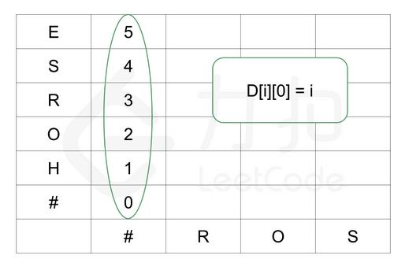
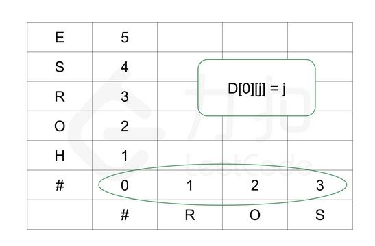

##72. Edit Distance - hard - https://leetcode.com/problems/edit-distance/
```
Given two words word1 and word2, find the minimum number of operations required to convert word1 to word2.

You have the following 3 operations permitted on a word:

    Insert a character
    Delete a character
    Replace a character

Example 1:

Input: word1 = "horse", word2 = "ros"
Output: 3
Explanation: 
horse -> rorse (replace 'h' with 'r')
rorse -> rose (remove 'r')
rose -> ros (remove 'e')

Example 2:

Input: word1 = "intention", word2 = "execution"
Output: 5
Explanation: 
intention -> inention (remove 't')
inention -> enention (replace 'i' with 'e')
enention -> exention (replace 'n' with 'x')
exention -> exection (replace 'n' with 'c')
exection -> execution (insert 'u')
```
###Solution - two-dimensional DP(increase dimension) 
###Time Complexity: O(MN), Space Complexity: O(MN) - M, N are the lengths of word1, word2
###DP Function:
###if(X(i) == Y(i)) => D[i][i] = Min(D[i-1][i] + 1, D[i][i-1] + 1, D[i-1][i-1])
###else => D[i][i] = Min(D[i-1][i] + 1, D[i][i-1] + 1, D[i-1][i-1] + 1)
 
 
 
#####(HO => RO) : HO => R (2 steps: delete H, replace O with R) => RO (3 steps: delete H, replace O with R, add O) 
#####(HO => R0) : H => R (1 step) => O (1 + 0 step)
 
 