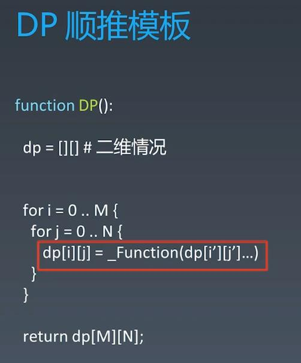

##DP Review
###Recursion

###Divide & Conquer

###The nature of the problem: find the repeatability

###Divide & Conquer - State Tree
###When it is able to select the best solution(or improvement, like memorization) in each step, it becomes DP(Dynamic Programming)

###E.g: Fibnacci: Divide & Conquer + Memorization = DP

###DP - Bottom-UP

###DP - Bottom-UP - the state transfer function(or recursion function)

###DP - Examples

###DP - Example: Stock - dp[i][k][1] means the state in the (i)th day, will finish (k)th trade, will have stock in hand, the k increases when buying stock
 
 
 
 
  
  
##Advanced DP

  
###Leetcode
####746. Min Cost Climbing Stairs - easy - https://leetcode.com/problems/min-cost-climbing-stairs/
####72. Edit Distance - hard - https://leetcode.com/problems/edit-distance/
####300. Longest Increasing Subsequence - medium - https://leetcode.com/problems/longest-increasing-subsequence/
######91. Decode Ways - medium - https://leetcode.com/problems/decode-ways/
