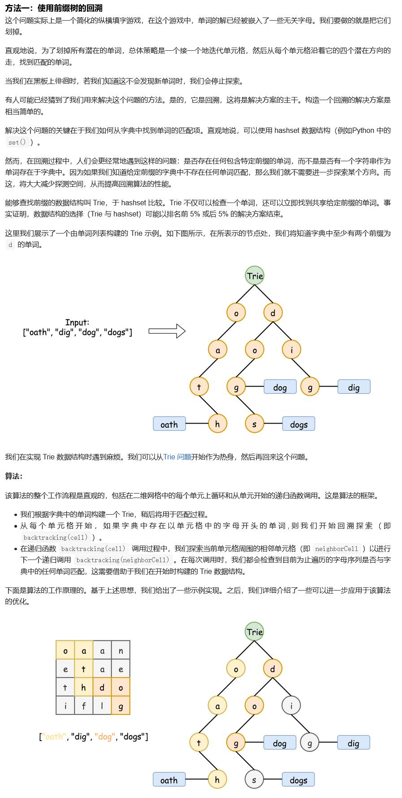

##212. Word Search II - hard - https://leetcode.com/problems/word-search-ii/
```
Given a 2D board and a list of words from the dictionary, find all words in the board.

Each word must be constructed from letters of sequentially adjacent cell, where "adjacent" cells are those horizontally or vertically neighboring. The same letter cell may not be used more than once in a word.

 

Example:

Input: 
board = [
  ['o','a','a','n'],
  ['e','t','a','e'],
  ['i','h','k','r'],
  ['i','f','l','v']
]
words = ["oath","pea","eat","rain"]

Output: ["eat","oath"]

 

Note:

    All inputs are consist of lowercase letters a-z.
    The values of words are distinct.
提示:

    你需要优化回溯算法以通过更大数据量的测试。你能否早点停止回溯？
    如果当前单词不存在于所有单词的前缀中，则可以立即停止回溯。什么样的数据结构可以有效地执行这样的操作？散列表是否可行？为什么？ 前缀树如何？如果你想学习如何实现一个基本的前缀树，请先查看这个问题： 实现Trie（前缀树）。
```
###Solution - Trie with Back_track - TC: O(N * Depth) - N is the number of chars in the board, Depth is the depth of the Trie 
###https://leetcode-cn.com/problems/word-search-ii/solution/dan-ci-sou-suo-ii-by-leetcode/

```
    public List<String> findWords(char[][] board, String[] words) {
        Trie trie = new Trie();
        List<String> result = new ArrayList<>();
        if (board == null || board.length == 0) return result;

        //store words in Trie
        for (String word : words) trie.insert(word);

        //traverse each cell
        for (int i = 0; i < board.length; i++) {
            for (int j = 0; j < board[0].length; j++) {
                dfs_backtrack(board, i, j, trie.root, result);
            }
        }
        return result;
    }

    private void dfs_backtrack(char[][] board, int x, int y, TrieNode node, List<String> result) {
        //terminator
        if (x < 0 || x >= board.length || y < 0 || y >= board[0].length) return;
        char ch = board[x][y];
        // ch == '$' means ch has been visited before
        if (ch == '$' || node.children[ch - 'a'] == null) return;

        node = node.children[ch - 'a'];
        //if found a word
        if (node.word != null) {
            result.add(node.word);
            node.word = null;
        }
        //traverse four directions, set current to be '$', otherwise child node will traverse back
        board[x][y] = '$';
        dfs_backtrack(board, x - 1, y, node, result);
        dfs_backtrack(board, x + 1, y, node, result);
        dfs_backtrack(board, x, y - 1, node, result);
        dfs_backtrack(board, x, y + 1, node, result);

        //set state back
        board[x][y] = ch;
    }

    class TrieNode {
        public TrieNode[] children = new TrieNode[26];
        public String word; // store word for leaf node
    }

    class Trie {
        TrieNode root = new TrieNode();

        public void insert(String word) {
            TrieNode node = root;
            for (char ch : word.toCharArray()) {
                if (node.children[ch - 'a'] == null) {
                    node.children[ch - 'a'] = new TrieNode();
                }
                node = node.children[ch - 'a'];
            }
            //store word on leaf node
            node.word = word;
        }
    }
```