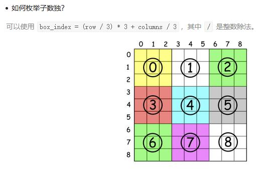

##36. Valid Sudoku - medium - https://leetcode.com/problems/valid-sudoku/

##Solution - Iteration one time(81 cells) - TC: O(1), SC: O(1), but String operation is slow

```
    public boolean isValidSudoku(char[][] board) {
        if (board == null || board.length == 0) return false;
        Set<String> set = new HashSet<>();
        for (int i = 0; i < 9; i++) {
            for (int j = 0; j < 9; j++) {
                char num = board[i][j];
                if (num != '.') {
                    if (!set.add(num + " in Row " + i)  // add row mark
                            || !set.add(num + " in Column " + j) // add column mark
                            || !set.add(num + " in Box " + i / 3 + "-" + j / 3) // add box mark
                    ) {
                        //if any mark failed, which means there is repeated number
                        return false;
                    }
                }
            }
        }
        return true;
    }
    
    //much faster than string operation
    public boolean isValidSudoku(char[][] board) {
        int size = board.length;
        HashSet<Integer> [] rows = new HashSet[size];
        HashSet<Integer> [] cols = new HashSet[size];
        HashSet<Integer> [] boxes = new HashSet[size];
        for (int i = 0; i < size; i++) {
            rows[i] = new HashSet<>();
            cols[i] = new HashSet<>();
            boxes[i] = new HashSet<>();
        }
        for (int i = 0; i < size; i++) {
            for (int j  = 0; j < size; j++) {
                if (board[i][j] == '.')
                    continue;
                int tmp = board[i][j] - '0';
                if (rows[i].contains(tmp)
                        || cols[j].contains(tmp) 
                        || boxes[(i / 3) * 3 + j / 3].contains(tmp)) 
                    return false;
                rows[i].add(tmp); 
                cols[j].add(tmp); 
                boxes[(i / 3) * 3 + j / 3].add(tmp); 
            }
        }
        return true;
    }
```

