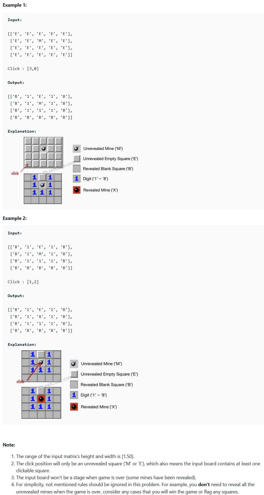

##529. Minesweeper - medium - https://leetcode.com/problems/minesweeper/
```
Let's play the minesweeper game (Wikipedia, online game)!

You are given a 2D char matrix representing the game board. 'M' represents an unrevealed mine, 'E' represents an unrevealed empty square, 'B' represents a revealed blank square that has no adjacent (above, below, left, right, and all 4 diagonals) mines, digit ('1' to '8') represents how many mines are adjacent to this revealed square, and finally 'X' represents a revealed mine.

Now given the next click position (row and column indices) among all the unrevealed squares ('M' or 'E'), return the board after revealing this position according to the following rules:

    If a mine ('M') is revealed, then the game is over - change it to 'X'.
    If an empty square ('E') with no adjacent mines is revealed, then change it to revealed blank ('B') and all of its adjacent unrevealed squares should be revealed recursively.
    If an empty square ('E') with at least one adjacent mine is revealed, then change it to a digit ('1' to '8') representing the number of adjacent mines.
    Return the board when no more squares will be revealed.
```

###Solution - DFS - TC: O(MN), SC: O(MN)
```
    public char[][] updateBoard(char[][] board, int[] click) {
        int x = click[0], y = click[1];
        if (board[x][y] == 'M') {
            board[x][y] = 'X';
        } else {
            int[][] dirs = {{0, 1}, {0, -1}, {1, 0}, {-1, 0}, {-1, -1}, {-1, 1}, {1, -1}, {1, 1}};
            dfs(board, x, y, dirs);
        }
        return board;
    }

    private void dfs(char[][] board, int i, int j, int[][] dirs) {
        // 递归终止条件：判断空地 (i, j) 周围是否有雷，若有，则将该位置修改为雷数，终止该路径的搜索。
        int cnt = 0;
        for (int[] dir : dirs) {
            int x = i + dir[0];
            int y = j + dir[1];
            if (x < 0 || x >= board.length || y < 0 || y >= board[0].length) continue;
            if (board[x][y] == 'M') cnt++;
        }
        if (cnt > 0) {
            board[i][j] = (char) (cnt + '0');
            return;
        }

        board[i][j] = 'B';
        for (int[] dir : dirs) {
            int x = i + dir[0];
            int y = j + dir[1];
            if (x < 0 || x >= board.length || y < 0 || y >= board[0].length || board[x][y] != 'E') continue;
            dfs(board, x, y, dirs);
        }
    }
```
###Solution - BFS - TC: O(MN), SC: O(MN)
```
    public char[][] updateBoard(char[][] board, int[] click) {
        int x = click[0], y = click[1];
        if (board[x][y] == 'M') {
            // 规则 1
            board[x][y] = 'X';
        } else {
            bfs(board, x, y);
        }
        return board;
    }

    private void bfs(char[][] board, int posX, int posY) {
        Queue<int[]> queue = new LinkedList<>();
        boolean[][] visited = new boolean[board.length][board[0].length];
        queue.offer(new int[]{posX, posY});
        visited[posX][posY] = true;
        int[][] dirs = {{0, 1}, {0, -1}, {1, 0}, {-1, 0}, {-1, -1}, {-1, 1}, {1, -1}, {1, 1}};
        while (!queue.isEmpty()) {
            int[] pos = queue.poll();
            int cnt = 0, x = pos[0], y = pos[1];
            // count surrounding mines
            for (int[] dir : dirs) {
                int tx = x + dir[0];
                int ty = y + dir[1];
                if (tx < 0 || tx >= board.length || ty < 0 || ty >= board[0].length) {
                    continue;
                }
                if (board[tx][ty] == 'M') {
                    ++cnt;
                }
            }
            if (cnt > 0) {
                // 规则 3
                board[x][y] = (char) (cnt + '0');
            } else {
                // 规则 2
                board[x][y] = 'B';
                for (int[] dir : dirs) {
                    int tx = x + dir[0];
                    int ty = y + dir[1];
                    // 这里不需要在存在 B 的时候继续扩展，因为 B 之前被点击的时候已经被扩展过了
                    if (tx < 0 || tx >= board.length || ty < 0 || ty >= board[0].length || board[tx][ty] != 'E' || visited[tx][ty]) {
                        continue;
                    }
                    queue.offer(new int[]{tx, ty});
                    visited[tx][ty] = true;
                }
            }
        }
    }
```