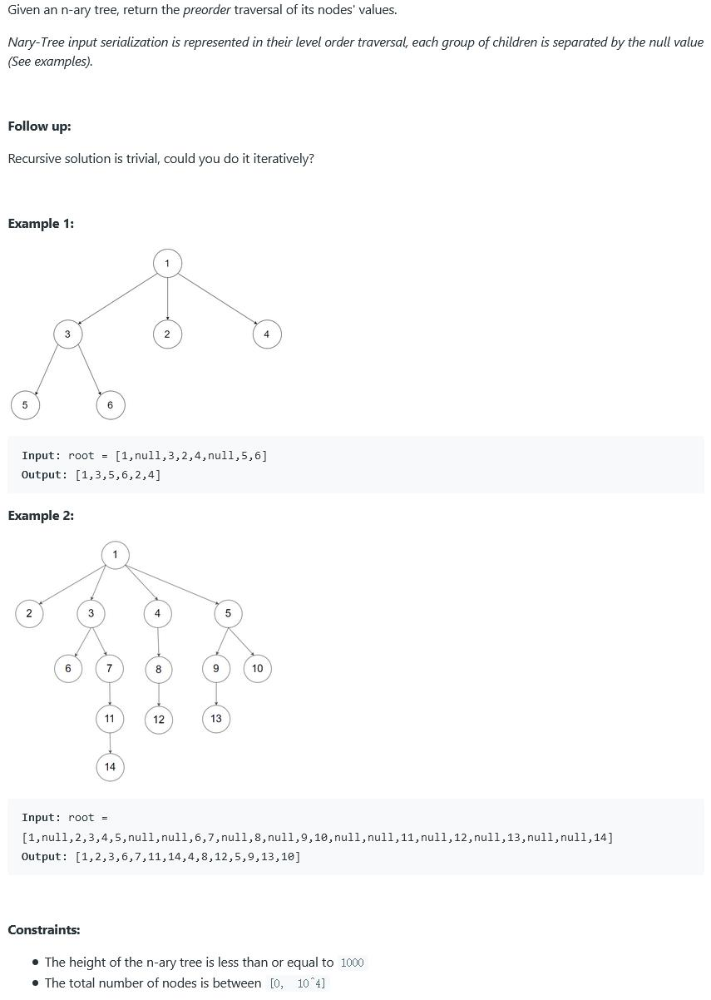

##589. N-ary Tree Preorder Traversal - easy - https://leetcode.com/problems/n-ary-tree-preorder-traversal/

```
    class Node {
        public int val;
        public List<Node> children;

        public Node() {
        }

        public Node(int _val) {
            val = _val;
        }

        public Node(int _val, List<Node> _children) {
            val = _val;
            children = _children;
        }
    }
```
##Solution 1 - Iteration - TC: O(N), SC: O(N)
```
    public List<Integer> preorder(Node root) {
        List<Integer> result = new ArrayList<>();
        if (root == null) return result;

        Stack<Node> stack = new Stack<>();
        stack.push(root);
        while (!stack.isEmpty()) {
            Node cur = stack.pop();
            result.add(cur.val);
            for (int i = cur.children.size() - 1; i >= 0; i--) {
                stack.push(cur.children.get(i));
            }
        }
        return result;
    }
```
##Solution 2 - Recursion - TC: O(N), SC: O(N)
```
    public List<Integer> preorder(Node root) {
        List<Integer> result = new ArrayList<>();
        preorder(root, result);
        return result;
    }
    
    private void preorder(Node root, List<Integer> list){
        if(root == null) return;
        list.add(root.val);
        for(Node node: root.children){
            preorder(node, list);
        }
    }
```