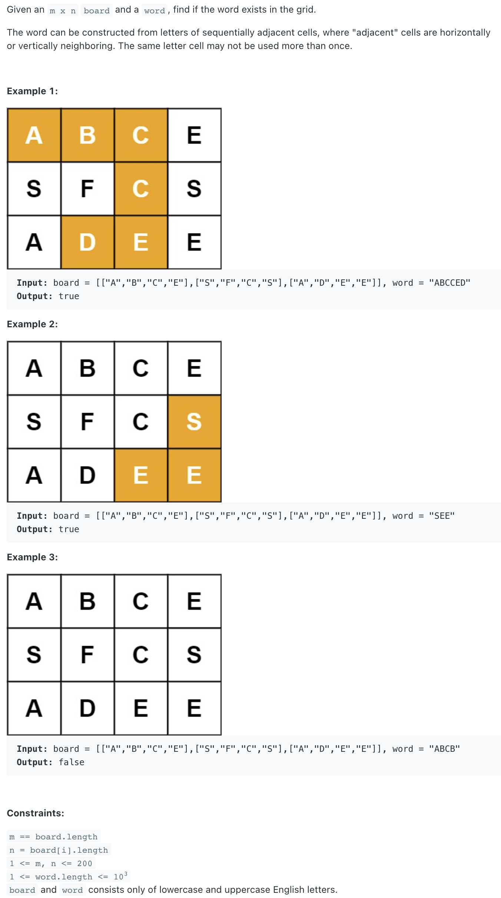

##79. Word Search - medium - https://leetcode.com/problems/word-search/
###Refer: 剑指 Offer 12. 矩阵中的路径

```
    public boolean exist(char[][] board, String word) {
        char[] words = word.toCharArray();
        for (int i = 0; i < board.length; i++) {
            for (int j = 0; j < board[0].length; j++) {
                if (dfs(board, i, j, words, 0)) return true;
            }
        }
        return false;
    }

    private boolean dfs(char[][] board, int i, int j, char[] word, int k) {
        if (i < 0 || j < 0 || i >= board.length || j >= board[0].length || board[i][j] != word[k])
            return false;
        if (k == word.length - 1) return true;
        board[i][j] = ' ';
        boolean res = dfs(board, i + 1, j, word, k + 1) || dfs(board, i, j + 1, word, k + 1)
                || dfs(board, i - 1, j, word, k + 1) || dfs(board, i, j - 1, word, k + 1);
        board[i][j] = word[k];
        return res;
    }
```