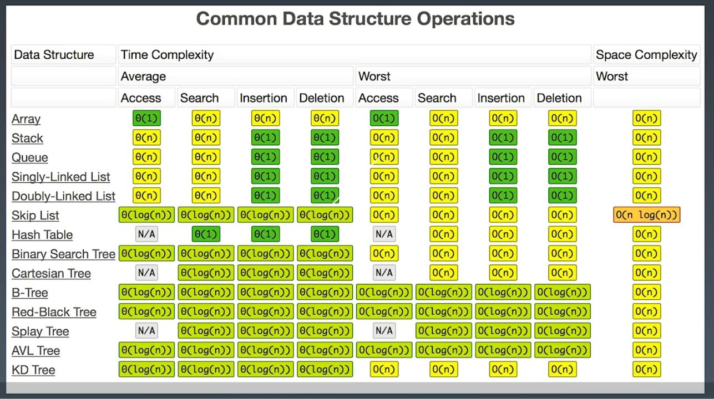

#Stack, Queue, Dequeue, Priority Queue
<br></br>
###Stack(class) - LIFO: Add/Delete: O(1), Search: O(N)
```
 * A more complete and consistent set of LIFO stack operations is
 * provided by the {@link Deque} interface and its implementations, which
 * should be used in preference to this class.  For example:
 *   Deque<Integer> stack = new ArrayDeque<Integer>();
 *
class Stack<E> extends Vector<E> {
    /**
     * Pushes an item onto the top of this stack. This has exactly
     * the same effect as: addElement(item)
     */
    public E push(E item) {
        addElement(item);

        return item;
    }

    /**
     * Removes the object at the top of this stack and returns that
     * object as the value of this function.
     */
    public synchronized E pop() {
        E       obj;
        int     len = size();

        obj = peek();
        removeElementAt(len - 1);

        return obj;
    }

    public synchronized E peek() {
        int     len = size();

        if (len == 0)
            throw new EmptyStackException();
        return elementAt(len - 1);
    }

    public synchronized int search(Object o) {
        int i = lastIndexOf(o);

        if (i >= 0) {
            return size() - i;
        }
        return -1;
    }
}
```
###Queue(interface) - FIFO: Add/Delete: O(1), Search: O(N)
```
Interface Queue<E>
Known Implementing Classes: LinkedList, ArrayDeque(Deque), PriorityQueue

A collection designed for holding elements prior to processing. Besides basic Collection operations, 
queues provide additional insertion, extraction, and inspection operations. 
Each of these methods exists in two forms: one throws an exception if the operation fails, 
the other returns a special value (either null or false, depending on the operation). 
The latter form of the insert operation is designed specifically for use with capacity-restricted Queue implementations; 
in most implementations, insert operations cannot fail.

Method Summary
Summary of Queue methods 	Throws exception 	Returns special value
                  Insert 	          add(e) 	             offer(e)
                  Remove 	        remove() 	               poll()
                 Examine 	       element() 	               peek()

boolean 	add(E e) 	Inserts the specified element into this queue if it is possible to do so immediately without violating capacity restrictions, returning true upon success and throwing an IllegalStateException if no space is currently available.
E 	        element() 	Retrieves, but does not remove, the head of this queue.
boolean     offer(E e) 	Inserts the specified element into this queue if it is possible to do so immediately without violating capacity restrictions.
E 	        peek() 	    Retrieves, but does not remove, the head of this queue, or returns null if this queue is empty.
E 	        poll() 	    Retrieves and removes the head of this queue, or returns null if this queue is empty.
E 	        remove() 	Retrieves and removes the head of this queue.
```
###Dequeue(interface) - Support both FIFO, LIFO: Add/Delete: O(1), Search: O(N)
```
Interface Deque<E>
Implementing Classes: ArrayDeque, LinkedList
```

###PriorityQueue(interface)
####-Get element out based on Priority
####-Add: O(1), Delete: O(logN), Search: O(logN) - based on priority
####-The Implementation can be different: heap, bst(binary search tree), treap
```
Class PriorityQueue<E>

Description: An unbounded priority queue based on a priority heap. 
The elements of the priority queue are ordered according to their natural ordering, 
or by a Comparator provided at queue construction time, depending on which constructor is used. 
A priority queue does not permit null elements. A priority queue relying on natural ordering also does not permit insertion of non-comparable objects (doing so may result in ClassCastException)

Constructor: PriorityQueue(), PriorityQueue(Comparator<? super E> comparator)

methods refer to Queue
```
<br></br>
##Data Structure - TC

<br></br>
###LeetCode
####20. Valid Parentheses - easy - https://leetcode.com/problems/valid-parentheses/
####155. Min Stack - easy - https://leetcode.com/problems/min-stack/
####84. Largest Rectangle in Histogram - hard - https://leetcode.com/problems/largest-rectangle-in-histogram/
####85. Maximal Rectangle - hard - https://leetcode-cn.com/problems/maximal-rectangle/
####239. Sliding Window Maximum - hard - https://leetcode.com/problems/sliding-window-maximum/
####641. Design Circular Deque - medium - https://leetcode.com/problems/design-circular-deque/
####42. Trapping Rain Water - hard - https://leetcode.com/problems/trapping-rain-water/