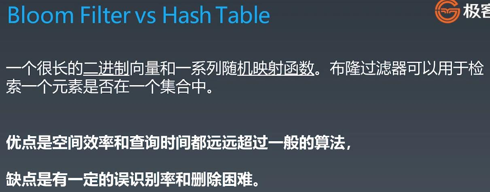
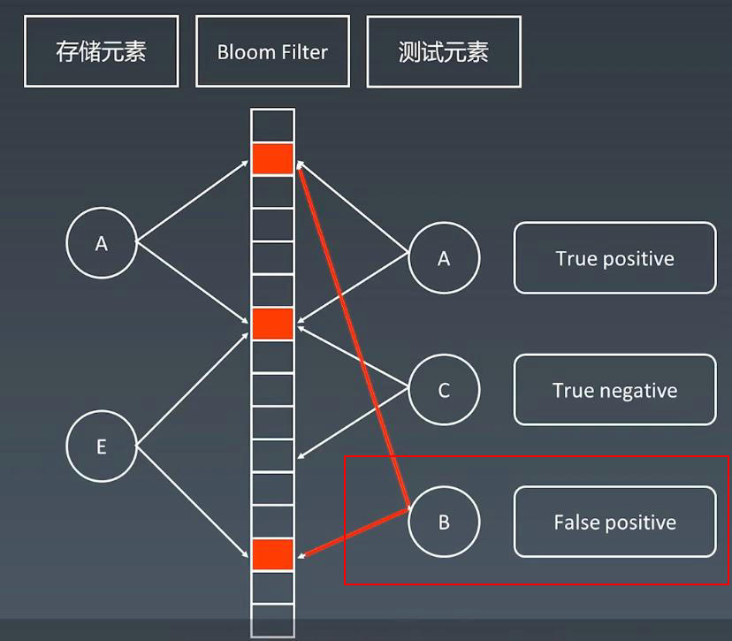
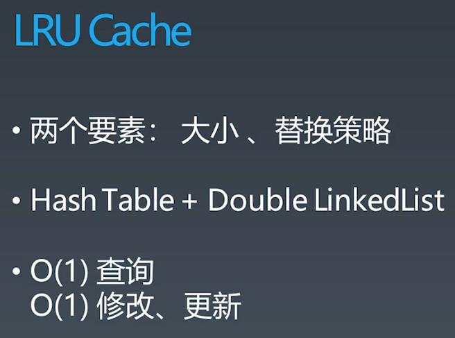
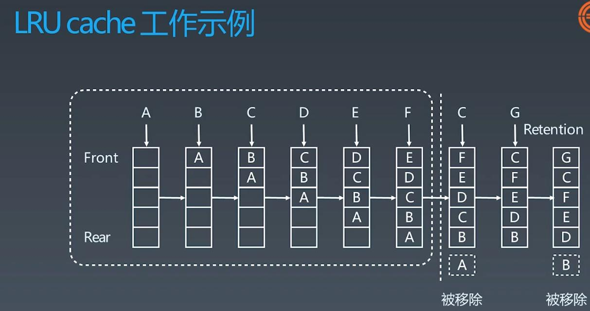
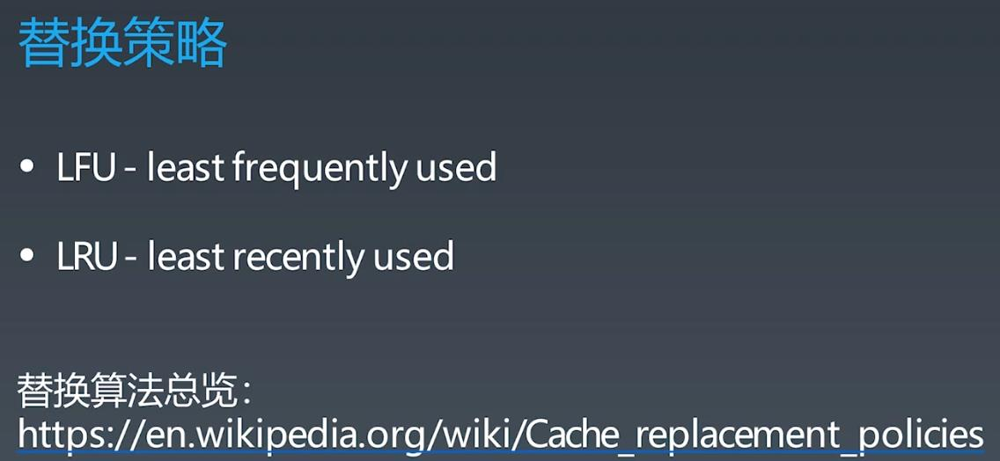

##Bloom Filter, LRU Cache
<br></br>
###Traditional Way of Hash Table Storage

<br></br>
###Bloom filter is an advanced search which only tells if element may exists or not exists
###it is only used in the most-outer layer as a quick search cache

###Bloom filter uses bits to store info

###When find a item in the bloom filter which means it may exist, if not found means it is not in the filter 100%, in reality, if bloom filter find the search item, then the system will continue to search in the DB or other storage system
###E.g: When A, E is inserted, search B might be false positive 

###Bloom filter usage

###https://www.cnblogs.com/cpselvis/p/6265825.html
###https://blog.csdn.net/tianyaleixiaowu/article/details/74721877
###Simple Bloom Filter Implementation: 
###https://github.com/lovasoa/bloomfilter/blob/master/src/main/java/BloomFilter.java
###https://github.com/Baqend/Orestes-Bloomfilter
<br></br>
<br></br>
##LRU Cache (LRU - least recently used)

###LRU Cache Implementation - HashTable + Double LinkedList

###LRU Cache Insert - How does it work - insert A -> B -> C -> D -> E -> F -> C -> G

###Cache Replacement Policies: FIFO, LIFO, LRU ...: https://en.wikipedia.org/wiki/Cache_replacement_policies

###Simple LRU implementation:
```
class LRUCache {
    private Map<Integer, Node> cache = new HashMap<>();
    private int size, capacity;
    // create boundary node, boundaryLeft.next will be head node, boundaryRight.prev will be tail node
    private Node boundaryLeft, boundaryRight;

    public LRUCache(int capacity) {
        this.size = 0;
        this.capacity = capacity;
        //false head, tail
        boundaryLeft = new Node();
        boundaryRight = new Node();
        boundaryLeft.next = boundaryRight;
        boundaryRight.prev = boundaryLeft;
    }

    public int get(int key) {
        Node node = cache.get(key);
        if (node == null) return -1;
        //because node is being searched, move the node to head
        moveToHead(node);
        return node.value;
    }

    public void put(int key, int value) {
        Node node = cache.get(key);
        if (node == null) {
            Node newNode = new Node(key, value);
            cache.put(key, newNode);
            addToHead(newNode);
            ++size;
            if (size > capacity) {
                Node tail = removeTail();
                cache.remove(tail.key);
                --size;
            }
        } else {
            node.value = value;
            moveToHead(node);
        }
    }

    private void moveToHead(Node node) {
        removeNode(node);
        addToHead(node);
    }

    private void addToHead(Node node) {
        node.prev = boundaryLeft;
        node.next = boundaryLeft.next;
        boundaryLeft.next.prev = node;
        boundaryLeft.next = node;
    }

    private void removeNode(Node node) {
        node.prev.next = node.next;
        node.next.prev = node.prev;
    }

    private Node removeTail() {
        //tails if false node, so the real tail the tail.prev
        Node res = boundaryRight.prev;
        removeNode(res);
        return res;
    }

    class Node {
        int key, value;
        Node prev, next;

        public Node() {
        }

        public Node(int key, int value) {
            this.key = key;
            this.value = value;
        }
    }
}
```
<br></br>
###Leetcode
####146. LRU Cache - medium - https://leetcode.com/problems/lru-cache/