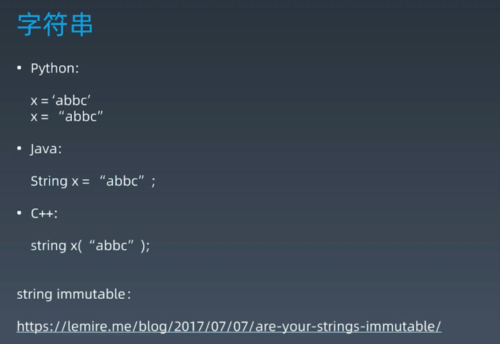
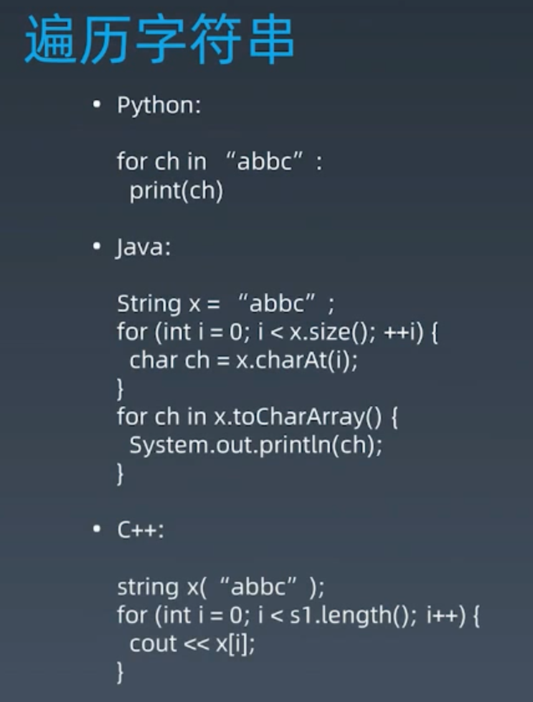
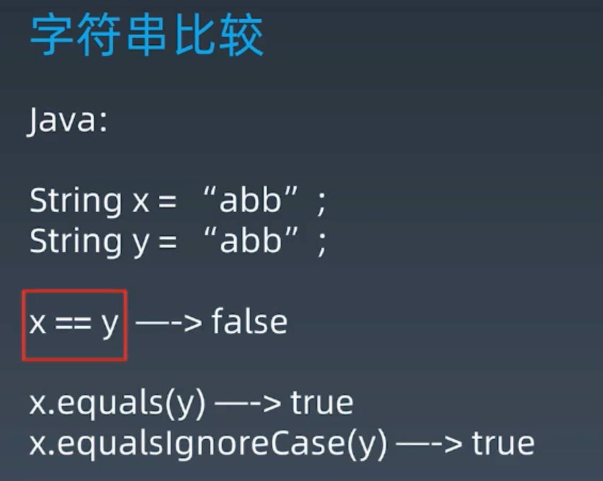
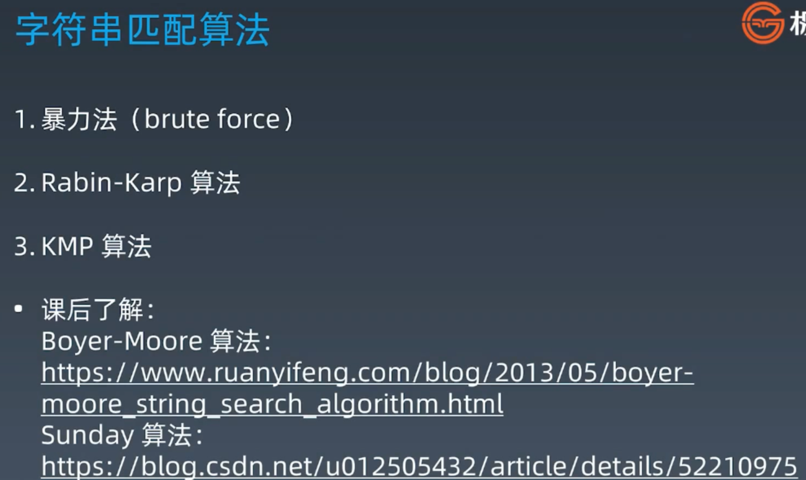
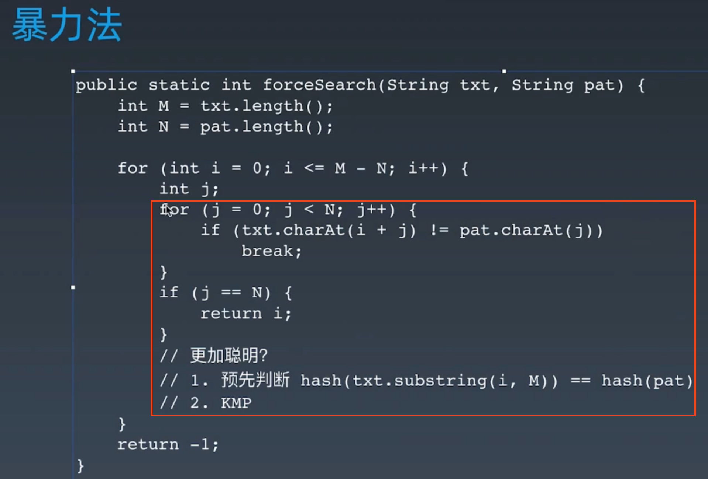
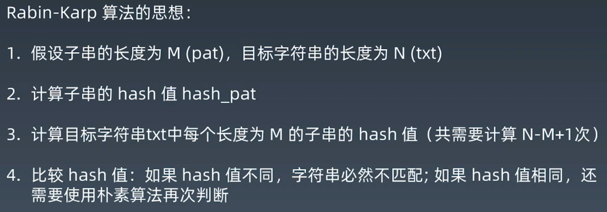
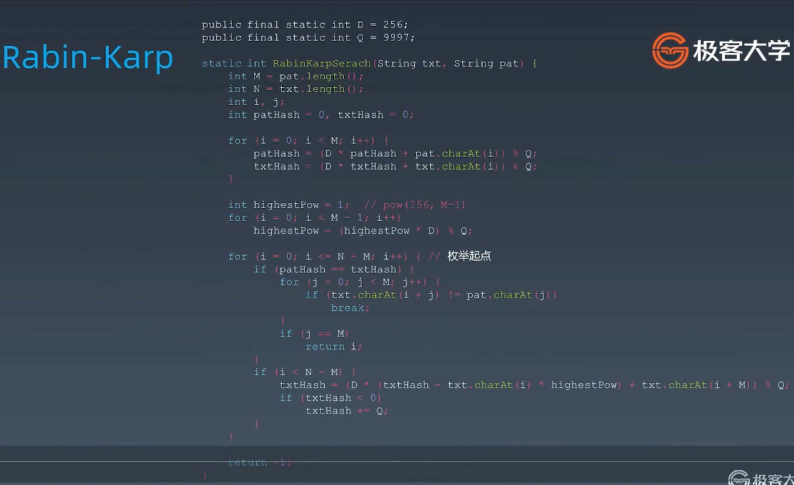
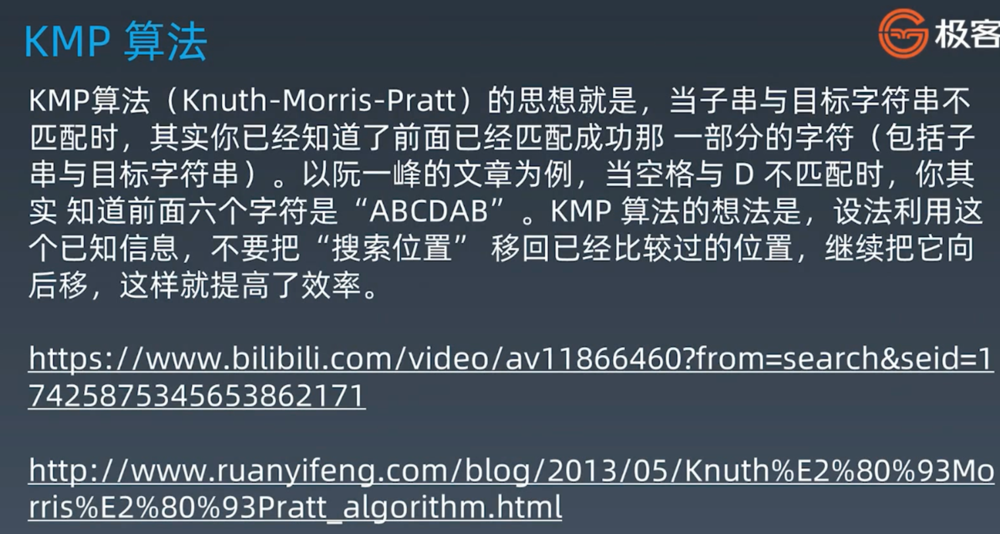

##Elementary String Operation 
###String in Java & Python is immutable
###https://lemire.me/blog/2017/07/07/are-your-strings-immutable/

###Traverse String - In Java: search in char[] is faster than String.charAt function 

###String Compare - Compare Reference Address vs Compare Value

###ASCII Code => a-z：97-122, A-Z：65-90, 0-9：48-57
###Leetcode:
####709. To Lower Case - easy - https://leetcode.com/problems/to-lower-case/
####58. Length of Last Word - easy - https://leetcode.com/problems/length-of-last-word/
####771. Jewels and Stones - easy - https://leetcode.com/problems/jewels-and-stones/
####387. First Unique Character in a String - easy - https://leetcode.com/problems/first-unique-character-in-a-string/
####8. String to Integer (atoi) - medium - https://leetcode.com/problems/string-to-integer-atoi/
####14. Longest Common Prefix - easy - https://leetcode.com/problems/longest-common-prefix/
####344. Reverse String - easy - https://leetcode.com/problems/reverse-string/
####541. Reverse String II - easy - https://leetcode-cn.com/problems/reverse-string-ii/
####151. Reverse Words in a String - medium - https://leetcode.com/problems/reverse-words-in-a-string/
####557. Reverse Words in a String III - easy - https://leetcode.com/problems/reverse-words-in-a-string-iii/
  
##Advanced String Operation - Leetcode:
####72. Edit Distance - hard - https://leetcode.com/problems/edit-distance/
####1143. Longest Common Subsequence - medium - http://leetcode.com/problems/longest-common-subsequence/
####5. Longest Palindromic Substring - medium - https://leetcode.com/problems/longest-palindromic-substring/
####10. Regular Expression Matching - hard - https://leetcode.com/problems/regular-expression-matching/
####115. Distinct Subsequences - hard - https://leetcode.com/problems/distinct-subsequences/
####https://leetcode.com/problems/wildcard-matching/
  
##String Matching Operation

###String Match - Brute Force - TC: O(M * N)

###Rabin-Karp

###KMP

###https://www.bilibili.com/video/av11866460?from=search&seid=17425875345653862171
###http://www.ruanyifeng.com/blog/2013/05/Knuth%E2%80%93Morris%E2%80%93Pratt_algorithm.html
